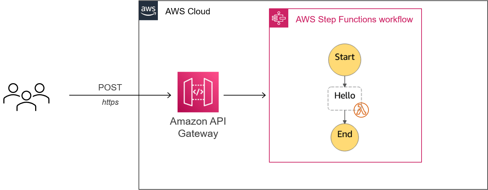
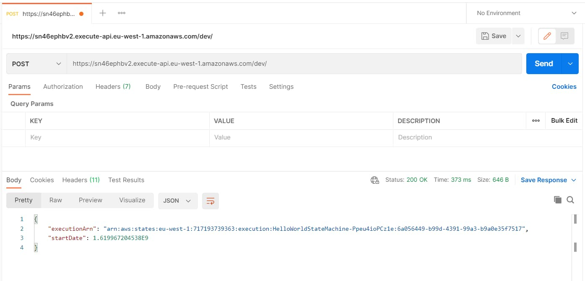
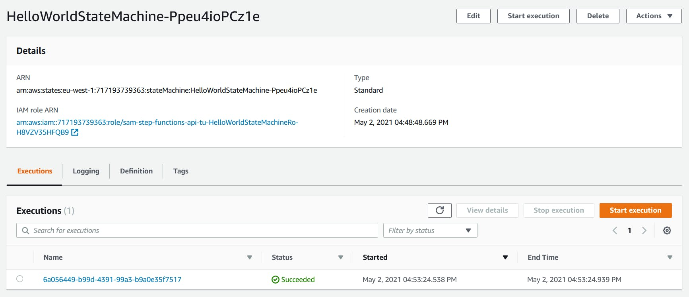

Last weekend I played with AWS Step Functions! I wanted to refactor a Lambda function I already coded for the sake of maintainability and evolutivity.



After having some fun with AWS Serverless Application Model (AWS SAM) refactoring and deploying my workflow on AWS, I wanted to call it from outside AWS with a simple endpoint.

Because it took me more than 2 minutes on the Internet to figure out how to do it, I thought it was necessary to have this blog post to help you.

Let's start!

## Overview

In this post, we will deploy a basic Step Functions workflow behind an API Gateway that a simple POST request as below will trigger:



And because we use AWS SAM, it will only take us a few lines of YAML. Nothing more!

## Amazon API Gateway

In the `template.yaml`, let's first define our API Gateway resource:

```yaml
Resources:
  HelloWorldApi:
    Type: AWS::Serverless::Api
    Properties:
      StageName: dev
```

Here we created a new [Amazon API Gateway](https://docs.aws.amazon.com/serverless-application-model/latest/developerguide/sam-resource-api.html) called `HelloWorldApi` with the most basic information: the stage's name.

## AWS Step Functions state machine

Now, let's reference our API Gateway in the [state machine](https://docs.aws.amazon.com/serverless-application-model/latest/developerguide/sam-resource-statemachine.html)! To do so, create the `Events` section as defined below:

```yaml
HelloWorldStateMachine:
  Type: AWS::Serverless::StateMachine
  Properties:
    DefinitionUri: statemachine/hello_world.asl.json
    DefinitionSubstitutions:
      HelloWorldFunctionArn: !GetAtt HelloWorldFunction.Arn
    Events:
      HelloWorldApiEvent:
        Type: Api
        Properties:
          Method: post
          Path: /
          RestApiId:
            Ref: HelloWorldApi
    Policies:
      - LambdaInvokePolicy:
          FunctionName: !Ref HelloWorldFunction
```

The `Events` section contains all the triggers for our state machine. In our case, we defined an API event called `HelloWorldApiEvent` referencing our API Gateway created previously with also a POST request attached to it.

## Outputs

For convenience, let's define an additional output to know which endpoint use to trigger our workflow:

```yaml
Outputs:
  HelloWorldApi:
    Description: "API Gateway endpoint URL to call Hello World State Machine"
    Value: !Sub "https://${HelloWorldApi}.execute-api.${AWS::Region}.amazonaws.com/dev/"
```

We're now all settled to deploy our work. Let's see how in the next section!

## Deployment with AWS SAM

Now we finished editing our `template.yaml` which normally looks like this:

```yaml
AWSTemplateFormatVersion: "2010-09-09"
Transform: AWS::Serverless-2016-10-31
Description: >
  sam-step-functions-api-tutorial

  Sample SAM Template for sam-step-functions-api-tutorial

Resources:
  HelloWorldApi:
    Type: AWS::Serverless::Api
    Properties:
      StageName: dev

  HelloWorldStateMachine:
    Type: AWS::Serverless::StateMachine
    Properties:
      DefinitionUri: statemachine/hello_world.asl.json
      DefinitionSubstitutions:
        HelloWorldFunctionArn: !GetAtt HelloWorldFunction.Arn
      Events:
        HelloWorldApiEvent:
          Type: Api
          Properties:
            Method: post
            Path: /
            RestApiId:
              Ref: HelloWorldApi
      Policies:
        - LambdaInvokePolicy:
            FunctionName: !Ref HelloWorldFunction

  HelloWorldFunction:
    Type: AWS::Serverless::Function
    Properties:
      CodeUri: functions/hello-world/
      Handler: app.lambdaHandler
      Runtime: nodejs14.x

Outputs:
  HelloWorldApi:
    Description: "API Gateway endpoint URL to call Hello World State Machine"
    Value: !Sub "https://${HelloWorldApi}.execute-api.${AWS::Region}.amazonaws.com/dev/"
  HelloWorldStateMachineArn:
    Description: "Hello World state machine ARN"
    Value: !Ref HelloWorldStateMachine
  HelloWorldStateMachineRole:
    Description: "IAM Role created for Hello World state machine based on the specified SAM Policy Templates"
    Value: !GetAtt HelloWorldStateMachineRole.Arn
```

Let's first build our code with `sam build` command:

```
C:\sam-step-functions-api-tutorial>sam build
Building codeuri: C:\sam-step-functions-api-tutorial\functions\hello-world runtime: nodejs14.x metadata: {} functions: ['HelloWorldFunction']
Running NodejsNpmBuilder:NpmPack
Running NodejsNpmBuilder:CopyNpmrc
Running NodejsNpmBuilder:CopySource
Running NodejsNpmBuilder:NpmInstall
Running NodejsNpmBuilder:CleanUpNpmrc

Build Succeeded

Built Artifacts  : .aws-sam\build
Built Template   : .aws-sam\build\template.yaml

Commands you can use next
=========================
[*] Invoke Function: sam local invoke
[*] Deploy: sam deploy --guided
```

After that, let's deploy our work with `sam deploy -g` command and the following options:

```
C:\sam-step-functions-api-tutorial>sam deploy -g

Configuring SAM deploy
======================

        Looking for config file [samconfig.toml] :  Not found

        Setting default arguments for 'sam deploy'
        =========================================
        Stack Name [sam-app]: sam-step-functions-api-tutorial
        AWS Region [us-east-1]: eu-west-1
        #Shows you resources changes to be deployed and require a 'Y' to initiate deploy
        Confirm changes before deploy [y/N]:
        #SAM needs permission to be able to create roles to connect to the resources in your template
        Allow SAM CLI IAM role creation [Y/n]:
        Save arguments to configuration file [Y/n]:
        SAM configuration file [samconfig.toml]:
        SAM configuration environment [default]:

        Looking for resources needed for deployment: Not found.
        Creating the required resources...
```

After a few minutes, you'll get something similar to the following output:

```

CloudFormation outputs from deployed stack
------------------------------------------------------------------------------------------------------------------------------------------------------------------
Outputs
------------------------------------------------------------------------------------------------------------------------------------------------------------------
Key                 HelloWorldStateMachineArn
Description         Hello World state machine ARN
Value               arn:aws:states:eu-west-1:717193739363:stateMachine:HelloWorldStateMachine-Ppeu4ioPCz1e

Key                 HelloWorldStateMachineRole
Description         IAM Role created for Hello World state machine based on the specified SAM Policy Templates
Value               arn:aws:iam::717193739363:role/sam-step-functions-api-tu-HelloWorldStateMachineRo-H8VZV35HFQB9

Key                 HelloWorldApi
Description         API Gateway endpoint URL to call Hello World State Machine
Value               https://sn46ephbv2.execute-api.eu-west-1.amazonaws.com/dev/
------------------------------------------------------------------------------------------------------------------------------------------------------------------

Successfully created/updated stack - sam-step-functions-api-tutorial in eu-west-1
```

Our work is now deployed on AWS and ready to be triggered!

For instance, with Postman:



And the associated result in AWS:



### Conclusion

You attached an API Gateway to a Step Functions workflow with AWS SAM! 🎉🎉

It took us only a few lines of YAML to combine these services. Very convenient!

You can find the GitHub repository with the complete code here:
[https://github.com/johanrin/sam-step-functions-api-tutorial](https://github.com/johanrin/sam-step-functions-api-tutorial)

That's it for me, hope you learned something! If you have any questions, [find me on Twitter](https://twitter.com/johanrin) and feel free to ask me anything 🙏
