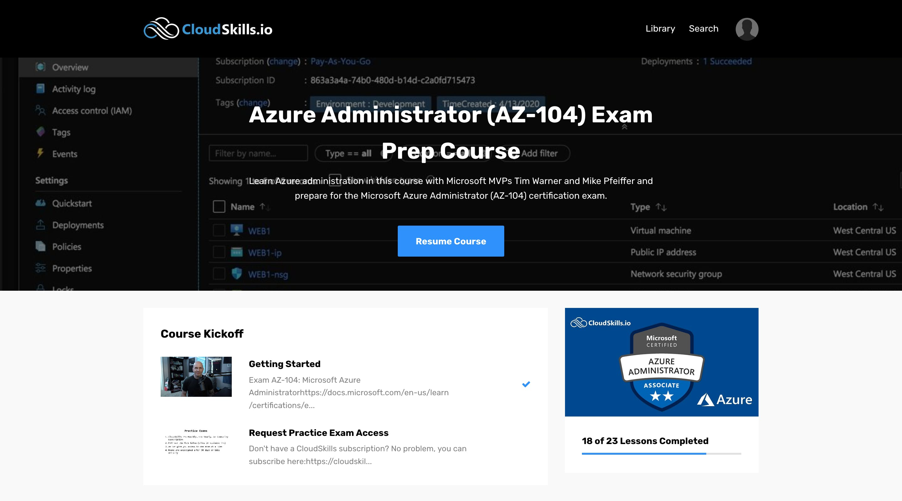

After becoming Azure Solutions Architect Expert Certified in October, I challenged myself to pass the AZ-104 Microsoft Azure Administrator exam before the end of 2020!



I didn't start my preparation right away. At first, I spent 20 days sharpening my PowerShell skills to understand my course, which included many PowerShell commands.

This post will explain the AZ-104 exam and how I prepared for it.

Let's begin!

## What is the AZ-104 exam?

The AZ-104 exam is the exam you have to pass to be **Azure Administrator Associate Certified**. It measures your ability to accomplish technical tasks as an Azure administrator.

If you're familiar with AWS, this exam is equivalent to the SysOps Administrator Associate.

## What skills do this exam measure?

From the skills outline, the skills tested during the exam are the following:

#### Manage Azure identities and governance (15-20%)

- Manage Azure AD objects
- Manage role-based access control (RBAC)
- Manage subscriptions and governance

#### Implement and manage storage (10-15%)

- Manage storage accounts
- Manage data in Azure Storage
- Configure Azure files and Azure blob storage

#### Deploy and manage Azure compute resources (25-30%)

- Configure VMs for high availability and scalability
- Automate deployment and configuration of VMs
- Create and configure VMs
- Create and configure containers
- Create and configure Web Apps

#### Configure and manage virtual networking (30-35%)

- Implement and manage virtual networking
- Configure name resolution
- Secure access to virtual networks
- Configure load balancing
- Monitor and troubleshoot virtual networking
- Integrate an on-premises network with an Azure virtual network

#### Monitor and back up Azure resources (10-15%)

- Monitor resources by using Azure Monitor
- Implement backup and recovery

As you can imagine, this is an in-depth exam which will test you on technical skills. So be sure to spend many hours on your hands-on labs in addition to your course!

## How much does the exam cost?

The exam costs $165, but you can schedule it for free with a voucher. Be sure to follow me on [Twitter](https://twitter.com/johanrin) — I tweet every time I find opportunities to get free vouchers.



To schedule your AZ-104 exam, go to the Microsoft certification page here: [https://docs.microsoft.com/en-us/learn/certifications/exams/az-104](https://docs.microsoft.com/en-us/learn/certifications/exams/az-104).

## How to prepare for the exam?

I used CloudSkills intensively for this exam. From [my previous experience with the AZ-300](https://johanrin.com/posts/azure-architect-az-300/) and AZ-304 exam, I learned it was better to prepare with this platform directly.

For those who don't know, CloudSkills is a platform that provides Cloud & DevOps certification training using a practical, real-world, hands-on approach. The instructors are Microsoft MVP recognized in the industry: [Mike Pfeiffer](https://twitter.com/mike_pfeiffer) or [Tim Warner](https://twitter.com/TechTrainerTim), to mention just a few.

The course I used to complete my preparation was the [Azure Administrator (AZ-104) Exam Prep Course](https://cloudskills.io/courses/az-104).

With the course, you also have access to Whizlabs practice tests and other contents, like the following for one year:

- Microsoft Azure Fundamentals Certification AZ-900
- Microsoft Azure Solutions Architect Certification AZ-30X
- Microsoft Certified Azure Security Engineer AZ-500
- Microsoft Azure DevOps Engineer Certification AZ-400

## Conclusion

The combination of CloudSkills and Whizlabs practice tests was enough for me to pass the AZ-104 exam!



Compared to the AZ-30x exams, this exam wasn't difficult, but my preparation was chaotic as the end of the year approached. Fortunately, I managed to pass this exam one day before my birthday 🎉

If I had one recommendation, prepare for the AZ-900, AZ-104, and then AZ-303 & AZ-304. In this order.

Don't try to jump from AZ-900 to AZ-30x! It's painful, trust me... 😅

That's it for me, hope you learned something! If you have any questions, [find me on Twitter](https://twitter.com/johanrin) and feel free to ask me anything 🙏
