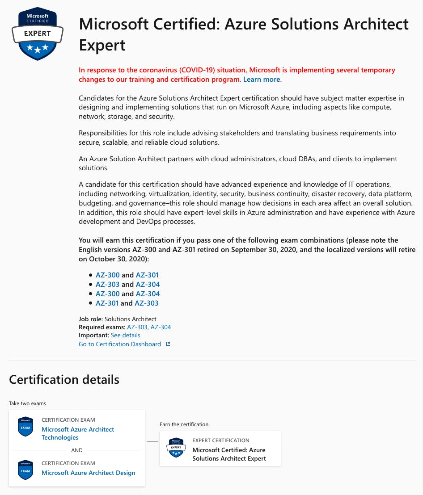
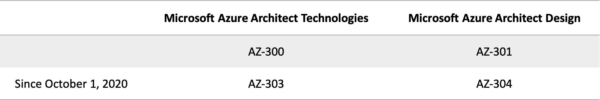
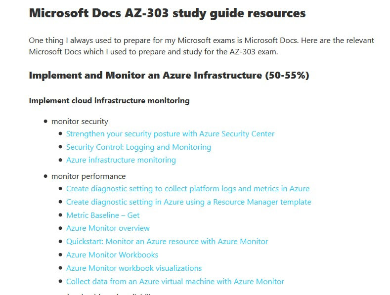

After [passing the AZ-900 Microsoft Azure Fundamentals exam](https://www.freecodecamp.org/news/how-i-passed-the-az-900-microsoft-azure-fundamentals-exam/), I challenged myself to get Azure Solutions Architect Expert certified! I knew this would not be easy from the start, but it's [only my eighth challenge this year](https://www.freecodecamp.org/news/how-i-got-awscertified-and-got-a-job-during-the-pandemic/), and nothing could stop me!



In this post, I will explain how I prepared for the AZ-300 Microsoft Azure Architect Technologies exam.

Let's begin.

## What is the AZ-300 exam?

In the Azure world, to get certified Solutions Architect Professional, you need to pass two exams: Microsoft Azure Architect Technologies and Microsoft Azure Architect Design.

Microsoft Azure Architect Technologies exam was commonly called AZ-300 and Microsoft Azure Architect Design AZ-301.

But since October 1, 2020, the exam names changed, and Microsoft incremented the numbers:

As the skills outline changed a bit between the [AZ-300](https://query.prod.cms.rt.microsoft.com/cms/api/am/binary/RE3VzwB) exam and [AZ-303](https://query.prod.cms.rt.microsoft.com/cms/api/am/binary/RE4psD6), be sure to check the appropriate one for your exam.

In the next sections, I'll focus on the AZ-300 because it's the one I prepared, but most of my content applies to the AZ-303 exam too.

I choose to take the AZ-300 exam because AZ-303 was still in beta at that time, and I didn't want to wait to get my results. That's enough stress for me to take an exam, no need to add by waiting for the results! (It can take up to two or three weeks...)

## What skills are measured during the exam?

From the skills outline, the skills tested during the exam are the following:

#### Deploy and configure infrastructure (40-45%)

- Analyze resource utilization and consumption
- Create and configure storage accounts
- Create and configure a VM for Windows and Linux
- Automate deployment of VMs
- Create connectivity between virtual networks
- Implement and manage virtual networking
- Manage Azure Active Directory
- Implement and manage hybrid identities
- Implement solutions that use virtual machines (VM)

#### Implement workloads and security (25-30%)

- Migrate servers to Azure
- Configure serverless computing
- Implement application load balancing
- Integrate on premises network with Azure virtual network
- Implement multi factor authentication
- Manage role-based access control

#### Create and deploy apps (5-10%)

- Create web apps by using PaaS
- Design and develop apps that run in containers

#### Implement authentication and secure data (5-10%)

- Implement authentication
- Implement secure data solutions

#### Develop for the cloud and for Azure storage (15-20%)

- Configure a message-based integration architecture
- Develop for autoscaling
- Develop solutions that use Cosmos DB storage
- Develop solutions that use a relational database

As you can see, it's an in-depth exam, so don't expect passing without solid knowledge and many hours of hands-on labs! To give you an example, I recall having many questions about Azure Active Directory and how to configure it in my exam.

## How much does the exam cost?

The exam isn't cheap. It will cost you $165, but if you're joining a Microsoft Challenge, it's possible to get a free Microsoft Certification exam!



To schedule your AZ-303 online exam with Pearson VUE, you can go to the certification page: [https://docs.microsoft.com/en-us/learn/certifications/exams/az-303](https://docs.microsoft.com/en-us/learn/certifications/exams/az-303).

## How to prepare for the exam?

### Microsoft Learn

You can start for free preparing the exam with Microsoft Learn, which is composed of nine learning paths:

1. [Architect network infrastructure in Azure](https://docs.microsoft.com/learn/paths/architect-network-infrastructure/)
2. [Architect storage infrastructure in Azure](https://docs.microsoft.com/learn/paths/architect-storage-infrastructure/)
3. [Architect compute infrastructure in Azure](https://docs.microsoft.com/learn/paths/architect-compute-infrastructure/)
4. [Architect infrastructure operations in Azure](https://docs.microsoft.com/learn/paths/architect-infrastructure-operations/)
5. [Architect a data platform in Azure](https://docs.microsoft.com/en-us/learn/paths/architect-data-platform/)
6. [Architect message brokering and serverless applications in Azure](https://docs.microsoft.com/learn/paths/architect-messaging-serverless/)
7. [Architect modern applications in Azure](https://docs.microsoft.com/en-us/learn/paths/architect-modern-apps/)
8. [Architect API integration in Azure](https://docs.microsoft.com/en-us/learn/paths/architect-api-integration/)
9. [Architect migration, business continuity, and disaster recovery in Azure](https://docs.microsoft.com/en-us/learn/paths/architect-migration-bcdr/)

Microsoft Learn has the advantages of having short scenarios with exercises you can try without delay.

But to be honest, I didn't feel confident to take my exam after finishing all the learning paths. It was too theoretical for me, especially for an expert level exam. Because I had many doubts, I asked the Cloud community recommendations to finish my preparation, and many people recommended me CloudSkills. So I decided to give it a try!



### CloudSkills

CloudSkills provides Cloud & DevOps certification training using a practical, real-world, hands-on approach. The instructors are Microsoft MVP recognized in the industry: [Mike Pfeiffer](https://twitter.com/mike_pfeiffer) or [Tim Warner](https://twitter.com/TechTrainerTim), to mention just a few.

The course I used to complete my preparation was the [Azure Solutions Architect (AZ-30x) Exam Prep Course](https://portal.cloudskills.io/az-30x).

The course cost $97, but you also have access to Whizlabs practice tests and the following content:

- Azure PowerShell: The Ultimate Beginners Course
- Docker JumpStart Virtual Workshop
- Azure DevOps Bootcamp
- Azure Administrator (AZ-104) Exam Prep Course
- Terraform on Azure
- Azure Certified Developer (AZ-204) Accelerated Exam Prep

For me, it worthed it because it really helped me to consolidate my knowledge and also gave me the motivation to finish my preparation when I was doubting.

Careful, the preparation is intense, but you can take it at your own pace, and in the end, you'll feel ready to take your exam!

### Thomas Maurer's study guides

For your hands-on labs, I recommend you to consolidate your knowledge with Thomas Maurer's study guides. He is a Senior Cloud Advocate at Microsoft and also former Microsoft MVP. He did a tremendous work summing up each Azure resources you need to pass your exam!

The cool thing is he did that for all the following exams:

- [Exam AZ-900: Microsoft Azure Fundamentals Exam Study Guide](https://www.thomasmaurer.ch/2020/03/az-900-study-guide-microsoft-azure-fundamentals-2020/)
- [Exam AZ-104: Microsoft Azure Administrator Exam Study Guide](https://www.thomasmaurer.ch/2020/03/az-104-study-guide-azure-administrator/)
- [Exam AZ-204: Developing Solutions for Microsoft Azure Exam Study Guide](https://www.thomasmaurer.ch/2020/03/az-204-study-guide-developing-solutions-for-microsoft-azure/)
- [Exam AZ-303: Microsoft Azure Architect Technologies Exam Study Guide](https://www.thomasmaurer.ch/2020/03/az-303-study-guide-azure-architect-technologies/)
- [Exam AZ-304: Microsoft Azure Architect Design Certification Exam Study Guide](https://www.thomasmaurer.ch/2020/04/az-304-study-guide-microsoft-azure-architect-design/)
- [Exam AZ-500: Microsoft Azure Security Technologies Exam Study Guide](https://www.thomasmaurer.ch/2020/05/az-500-study-guide-microsoft-azure-security-technologies-2020/)

### Conclusion

The combination of CloudSkills, Thomas Maurer's study guide, and Whizlabs practice tests were enough for me to pass the AZ-300 exam!



It's probably the most challenging exam I have prepared so far. I worked on it every single day from June to September at least one hour per day. The funny thing is back in June, I was still new to Azure, and it took me 150 days to pass the exam.

It was exhausting, and I'm very proud of this one. But if I had to do it again, I probably go directly with CloudSkills to save me some time.

That's okay! I'm not finished yet: my goal is to earn the Azure Solutions Architect Expert certification. So, I still need to pass the AZ-304 Microsoft Azure Architect Design exam. And if you follow me on Twitter, you can be sure that I'll share my progress until I get it!

That's it for me, hope you learned something! If you have any questions, [find me on Twitter](https://twitter.com/johanrin) and feel free to ask me anything 🙏
