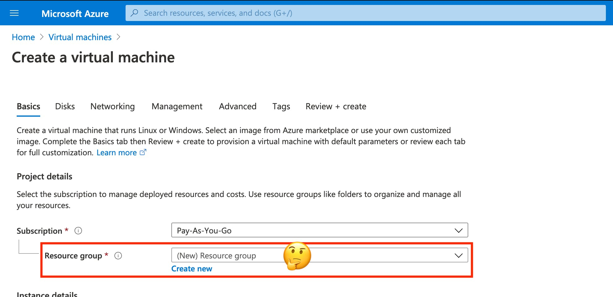
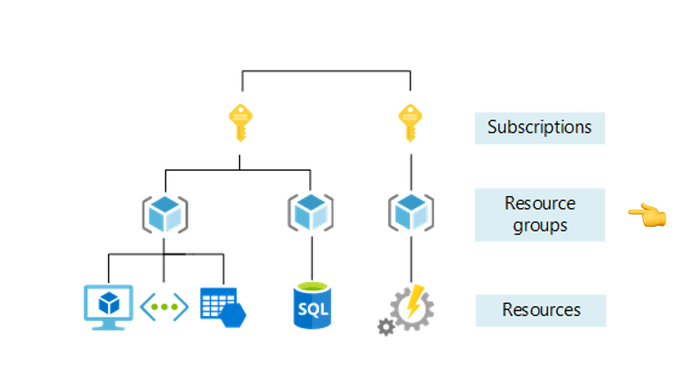
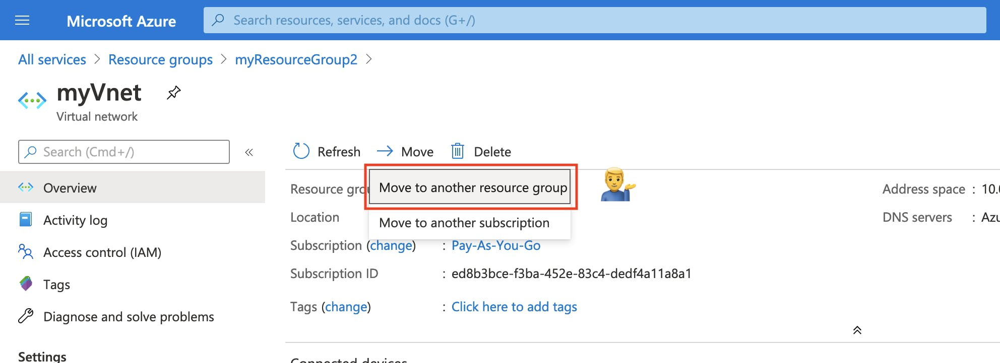
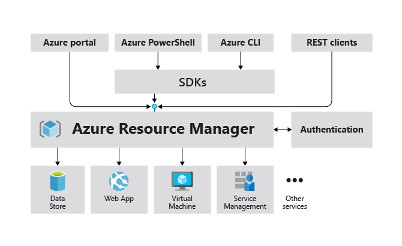
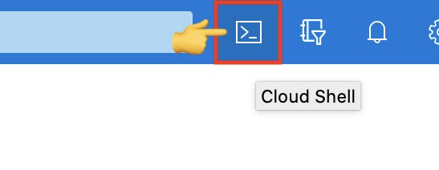

When I first used Azure to create a virtual machine, I was confused by Azure resource groups. I didn't understand why I needed it because it doesn't exist in AWS!

Resource groups are specific to Azure and critical to know.

In this post, I'll show you what resource group is, and we'll deploy your first virtual machine.

Let's begin.

## Resource

Before explaining what's a resource group, I have to explain what's a resource in Azure.

A **resource** is simply an instance of a service that you create in Azure. It can be anything! For example, virtual machines, web apps, databases, function apps, etc.

Here some popular Azure resources:


When you deploy a resource in Azure, it has to be included in a **resource group**.

If you have an AWS background like me, it's something weird, and I wanted to understand why I needed it.



## Resource group

A **resource group** is a logical container for your Azure resources. It helps you manage your resources as a group.

Imagine you have two types of environments for your app: productive and non-productive. You can choose to create two resource groups, one for each, and put all your resources on these resources groups.

Now, you may be wondering what's the benefits of this approach.

Let's say you want to apply roles to all your productive resources. You don't need to apply them for each resource. You can directly add your roles to resource groups!



Another benefit of resource groups is to force you to think about architecture. Every time you create a new resource, you have to think about which resource group you're gonna use. Because we tend to be uneasy with chaos, our brain gonna create order at some point.

For sure, you can decide to put everything in the same resource group, but it's easy to move your resources from one resource group to another.



Note: A resource group can contain resources located in different regions. For instance, you can have your virtual machine deployed in East US and your Azure Cosmos DB in West US.

## Azure Resource Manager

Now that we've seen what a resource group is, let's understand why we can use this resource (yes, a resource group is also... a resource).

Azure uses extensively **Azure Resource Manager (ARM)** to deploy and manage your services. It's a management layer that enables you to create, update, and delete resources in your account.

By management, we include features like grouping services together (resource groups) or locking resources to prevent unexpected changes.

Basically, when you send a request to Azure, you send a request to ARM!

Resource Manager checks if you have the authorizations and forward the request to the Azure service, which takes the action: creating the virtual machine for instance.



With this layer, we can do more powerful things like automating deployment with templates. In Azure, we call that: **ARM template**! It's a chapter in itself and I'll write about it in another post.

For now, let's deploy our first virtual machine with Azure CLI.

## Deploy a Virtual machine

### Prerequisites

You should have an Azure subscription to follow along and run the commands below. If you don't have one, create a [free account](https://azure.microsoft.com/free/?WT.mc_id=A261C142F) before you begin.

### Launch Azure Cloud Shell

We're gonna use Azure Cloud Shell to run our commands.

Azure Cloud Shell is an interactive, browser-accessible shell for managing Azure resources. We can use either Bash or PowerShell commands there.



### Create a resource group and virtual network

First, we'll create a resource group, a virtual network, and subnet for our virtual machine.

- Run the following command in the Cloud Shell to create the **myResourceGroup1** resource group.

```shell
az group create --name myResourceGroup1 --location eastus
```

- Run the following command in the Cloud Shell to create **VM-vnet** virtual network and the **VM-subnet** subnet.

```shell
az network vnet create \
    --resource-group myResourceGroup1 \
    --name VM-vnet \
    --address-prefix 10.0.0.0/16 \
    --subnet-name VM-subnet \
    --subnet-prefix 10.0.0.0/24
```

- Run the following command in the Cloud Shell to create **VM** virtual machine in the previous virtual network.

```shell
az vm create \
    --resource-group myResourceGroup1 \
    --name VM \
    --vnet-name VM-vnet \
    --subnet VM-subnet \
    --image UbuntuLTS \
    --size Standard_DS1_v2 \
    --admin-username azureuser \
    --admin-password MySecureP@ssword$
```

- Run the following command in the Cloud Shell to confirm that the virtual machine is up and running.

```shell
az vm list \
    --resource-group myResourceGroup1 \
    --show-details \
    --output table
```

## Conclusion

Congratulations, you created your first virtual machine in Azure! 🎉🎉🎉

In this post, you've learned about resource groups, the dependencies with resources, and Azure Resource Manager.

It was something very confusing for me at first. But now, that's okay 👍

That's it for me, hope you learned something! If you have any questions, [find me on Twitter](https://twitter.com/johanrin) and feel free to ask me anything 🙏
