Last time, we explored [what Microsoft Foundry is](https://johanrin.com/posts/getting-started-with-microsoft-foundry/) and why it matters.

Today, we are going hands-on with something more concrete. You will learn how to build your first agent in Microsoft Foundry and see the different possibilities the platform puts at your fingertips.

Let's begin.

## What is an agent

Before going further, it is important to clarify what an agent actually is.

The term appears everywhere in the AI community, yet it can feel abstract without the right analogy.

**Think of an agent like a chef in a kitchen.**


A chef looks at the available ingredients, understands what dish needs to be prepared, chooses the right steps, then uses the tools in the kitchen to get the job done.

An AI agent works the same way. It receives information, decides what to do, and takes action using the tools it has access to.

At its core, an agent is a system that perceives its environment, reasons about what it perceives, and takes actions to achieve a goal.

In practical terms, an AI agent:

- **Observes**, by gathering information through user messages or system events
- **Thinks**, by using an LLM as its brain to decide the next step
- **Acts**, by performing tasks using the tools available to it

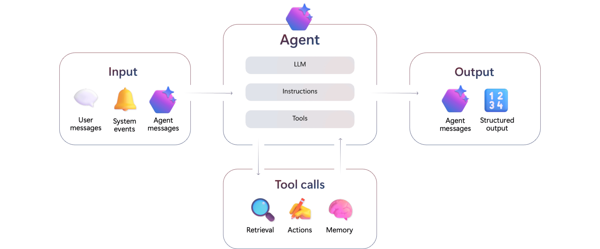

Now that this is clearer, let's build our first agent.

## Create your agent

To get started, open the Microsoft Foundry home page: https://ai.azure.com/.

On the home page, select **Start building**, then choose **Create agent**.

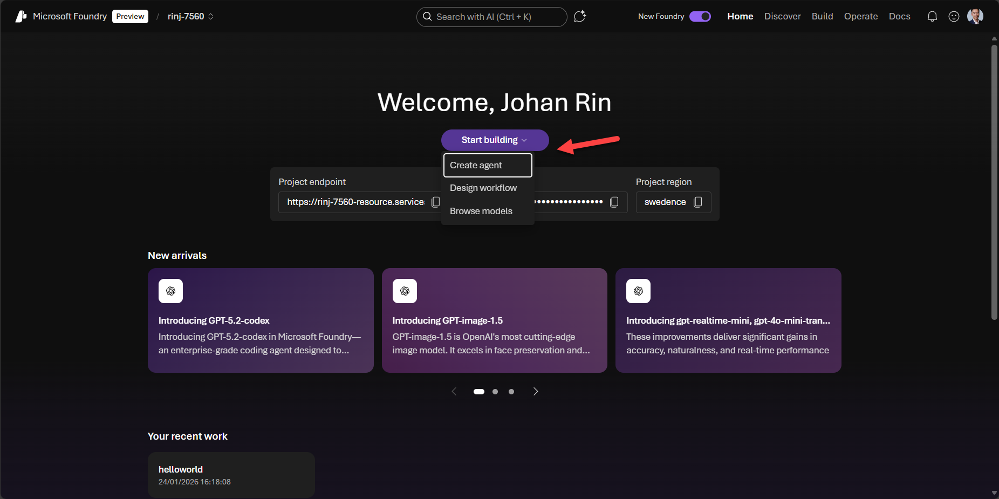

Give your agent a name and click **Create**.

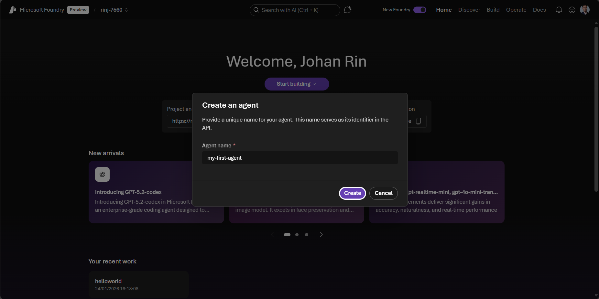

You now have a basic agent ready to customize.

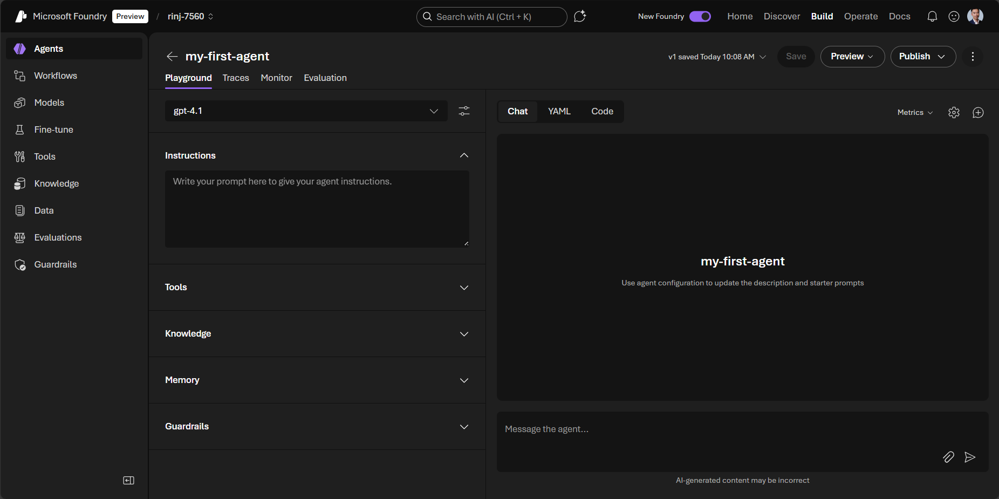

Several key sections define its behavior.

### Model

Here you can choose or adjust the model used by your agent. In my case, it is **gpt-4.1**.

You can also tune parameters like _Temperature_ or _Top P_ depending on whether you want a more creative or more deterministic agent.

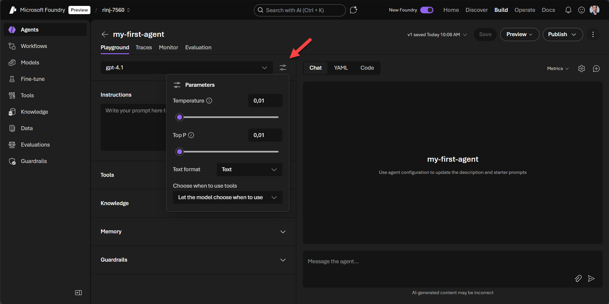

### Instructions

This is where you write the core prompt that guides your agent.

In my example, I simply used: **You are a helpful writing assistant.**

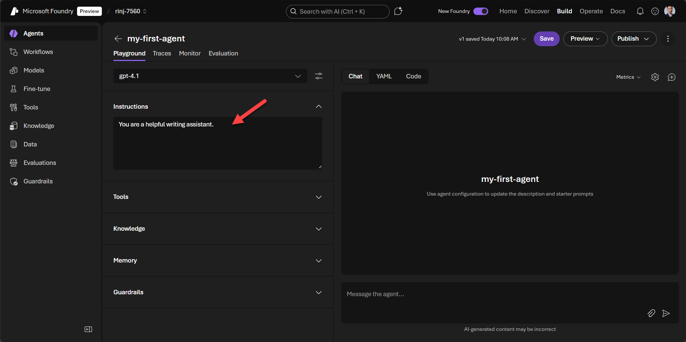

### Tools

Tools allow your agent to extend its capabilities.

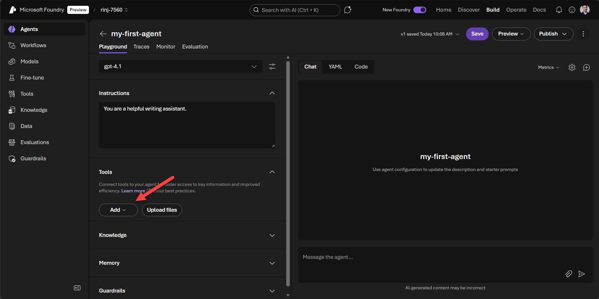

To add one, click **Add**, then select the one you need.

In my case, I added the **Web search** tool so my agent can look up information online.

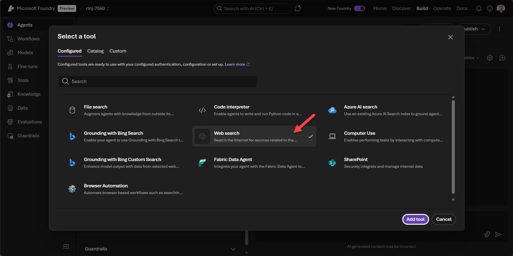

Note: this tool may generate additional costs.

Click **Add** to continue.

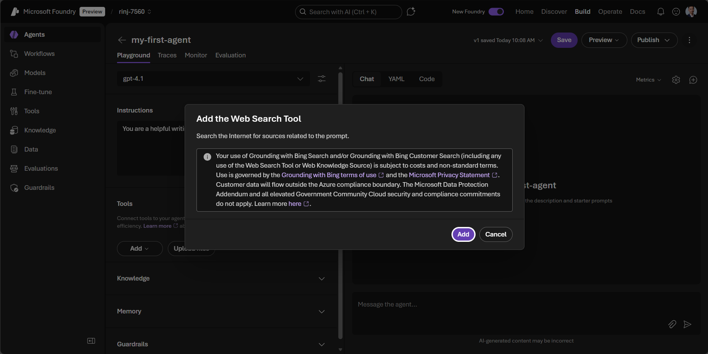

After adding it, the agent becomes capable of answering more complex queries.

For instance, I asked it to generate a complete weather report for Paris.

Do not forget to click **Save** to apply your changes.

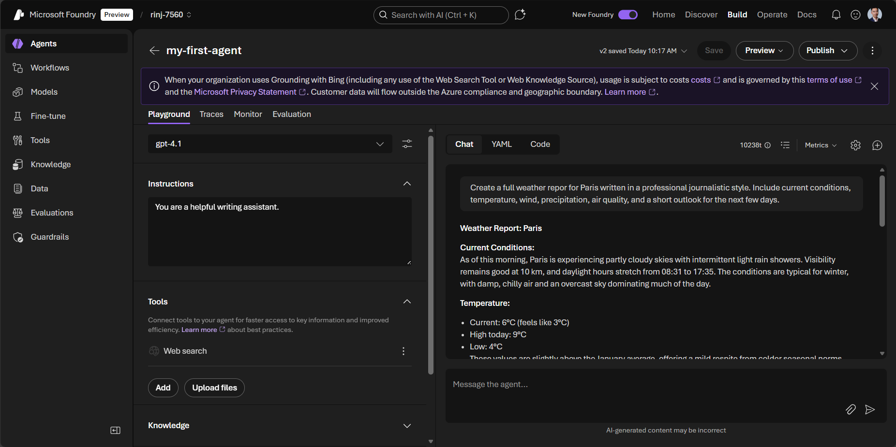

### Knowledge

In this section, you can connect your agent to knowledge bases for grounding.

In other words, it allows your agent to access your existing information sources, such as SharePoint or Azure AI search.

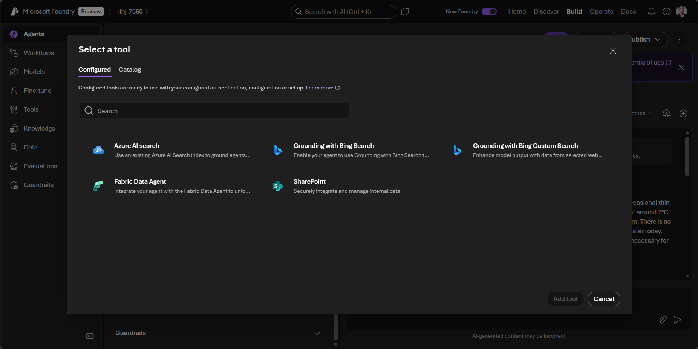

### Memory

Here, you can enable memory so your agent can retain context to personalize and improve interactions.

You need to set up an embedding model, such as _text-embedding-3-small_, to activate this functionality as memory uses embeddings to store and retrieve relevant context over long-term interactions.

### Guardrails

This section provides safety and security controls to prevent issues like prompt injection.

Microsoft enables a standard configuration by default that you can customize.

## Preview your agent

Once your agent is configured, you can test it directly in Microsoft Foundry.

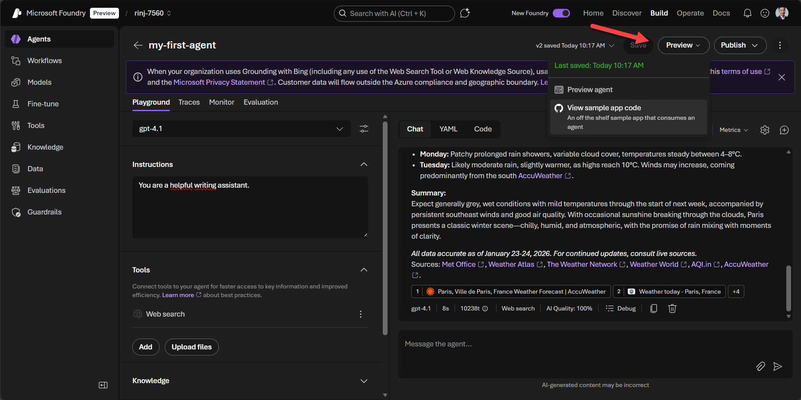

The preview area lets you interact with the agent and understand how it will behave when deployed.

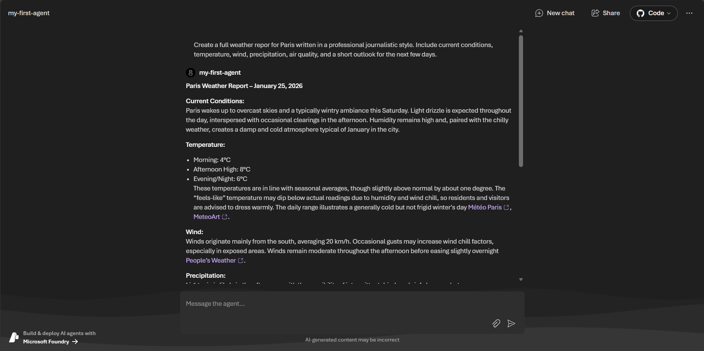

## Interact programmatically with your agent

Microsoft Foundry also provides ready‑to‑use code that allows you to interact with your agent programmatically.

The Microsoft Foundry SDK is available in Python, JavaScript, and C#.

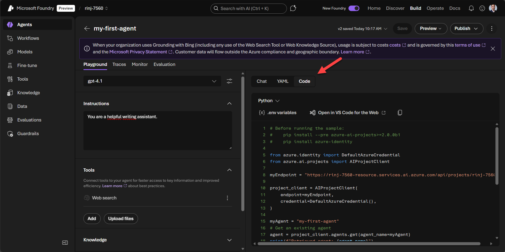

This is very useful if you plan to integrate your agent into an application or add custom logic.

Here is the Python code that was generated for me:

```python
# Before running the sample:
#    pip install --pre azure-ai-projects>=2.0.0b1
#    pip install azure-identity

from azure.identity import DefaultAzureCredential
from azure.ai.projects import AIProjectClient

myEndpoint = "https://rinj-7560-resource.services.ai.azure.com/api/projects/rinj-7560"

project_client = AIProjectClient(
    endpoint=myEndpoint,
    credential=DefaultAzureCredential(),
)

myAgent = "my-first-agent"
# Get an existing agent
agent = project_client.agents.get(agent_name=myAgent)
print(f"Retrieved agent: {agent.name}")

openai_client = project_client.get_openai_client()

# Reference the agent to get a response
response = openai_client.responses.create(
    input=[{"role": "user", "content": "Tell me what you can help with."}],
    extra_body={"agent": {"name": agent.name, "type": "agent_reference"}},
)

print(f"Response output: {response.output_text}")
```

Running this code in my environment prints a response based on the instructions I defined earlier.

```bash
(.venv) rinj:~/code/johanrin/my-first-agent$ python main.py
Retrieved agent: my-first-agent
Response output: I can assist you with a wide variety of writing-related tasks, including:

1. **Drafting and Editing**
   - Composing essays, articles, reports, emails, or letters
   - Correcting grammar, spelling, punctuation, and clarity
   - Improving sentence structure and style

2. **Research and Citations**
   - Providing accurate, cited information on a range of topics
   - Formatting citations in styles like APA, MLA, or Chicago

3. **Creative Writing**
   - Writing stories, poems, or scripts
   - Brainstorming ideas and developing plots or characters

4. **Academic Writing**
   - Assisting with homework, assignments, and research papers
   - Summarizing or analyzing sources
   - Creating outlines and thesis statements

5. **Technical and Business Writing**
   - Drafting proposals, reports, memos, and presentations
   - Editing for professionalism and clarity

6. **Resume and Cover Letter Assistance**
   - Writing and editing resumes and cover letters
   - Providing feedback on wording and formatting

7. **Translation and Language Help**
   - Translating text between languages (to a helpful degree)
   - Explaining word meanings or grammar

If you have a specific writing task or need help with something else, just let me know!
(.venv) rinj:~/code/johanrin/my-first-agent$
```

Since I configured my agent as a writing assistant, the response reflects this specialization.

You can also modify the user input to generate different outputs, such as a detailed weather report for Paris.

```python
response = openai_client.responses.create(
    input=[{"role": "user", "content": "Create a full weather report for Paris written in a professional journalistic style. Include current conditions, temperature, wind, precipitation, air quality, and a short outlook for the next few days."}],
    extra_body={"agent": {"name": agent.name, "type": "agent_reference"}},
)
```

Running this gives a more detailed result:

```bash
(.venv) rinj:~/code/johanrin/my-first-agent$ python main.py
Retrieved agent: my-first-agent
Response output: ### Paris Weather Report — January 25, 2026

**Current Conditions:**
Paris is experiencing classic winter weather today, with mostly cloudy skies and periods of light rain possible throughout the day. Temperatures during the morning were notably chilly, starting near 4°C, with the afternoon warming gradually to a high of around 9°C. The early hours were marked by some fog, adding to the atmospheric charm of the city this season [Sortiraparis](https://www.sortiraparis.com/en/news/in-paris/articles/332748-weather-forecast-for-paris-and-ile-de-france-from-january-19-to-25-2026).

**Temperature:**
- Morning low: 4°C
- Afternoon high: 9°C
- Evening: expected to return to near 5°C
Recent days have seen moderate temperature swings, from brisk 0°C mornings to unusually mild afternoons close to 12°C during sunny spells this week [Sortiraparis](https://www.sortiraparis.com/en/news/in-paris/articles/332748-weather-forecast-for-paris-and-ile-de-france-from-january-19-to-25-2026).

**Wind:**
Winds today remain light to moderate, generally from the northeast at 10–20 km/h. Gusts may pick up during showers but should stay below 25 km/h [Easeweather](https://www.easeweather.com/europe/france/ile-de-france/paris/past/january).

**Precipitation:**
Paris typically sees frequent precipitation in January — today, brief intervals of light rain are expected, but significant rainfall is not predicted. This month, Paris averages 15 days of rain, with total precipitation around 33 mm (1.3 inches), making an umbrella a common winter accessory [Weather Atlas](https://www.weather-atlas.com/en/france/paris-weather-january).

**Air Quality:**
Air quality in Paris during winter months is generally moderate, with pollutant levels reduced by regular rain. Fog and humidity can briefly increase particulate matter, but no health advisories are in place today. Sensitive groups should nonetheless remain cautious during early morning fog, which may concentrate pollutants closer to the ground [World Weather Info](https://world-weather.info/forecast/france/paris/january-2026/).

**Outlook (Next Few Days):**
The remainder of the week will see continued cold mornings (0–2°C), with afternoons gradually warming to between 8–10°C. Many days will stay cloudy, but intermittent sunny spells are forecast, especially around Tuesday and Friday. By midweek, expect some frosty fog and mist in the mornings. The risk of snow is minimal and confined mostly to late-night or early-morning hours later in the month [Weather Atlas](https://www.weather-atlas.com/en/france/paris-weather-january), [Easeweather](https://www.easeweather.com/europe/france/ile-de-france/paris/past/january).

---

**Summary:**
Paris enjoys a typical winter mood: damp, chilly, and atmospheric, with the occasional sparkle of sun breaking through. Rain and fog are frequent, and temperatures hover just above freezing in the mornings, allowing for brisk, refreshing strolls along its famed boulevards. The city’s classic winter scene continues for the coming days — pack warm layers, and don’t forget an umbrella.

For real-time updates, visit [Météo Paris](https://www.meteo-paris.com/) or [AccuWeather](https://www.accuweather.com/en/fr/paris/623/january-weather/623).
(.venv) rinj:~/code/johanrin/my-first-agent$
```

## Publish your agent

Once you are satisfied with your agent, you can publish it directly from the Microsoft Foundry interface.

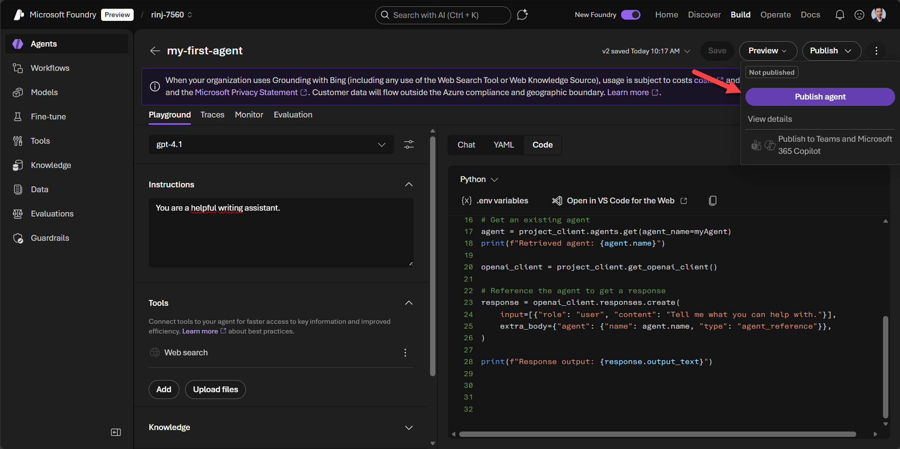

Click **Publish agent**, confirm in the popup, and the agent is ready for use.

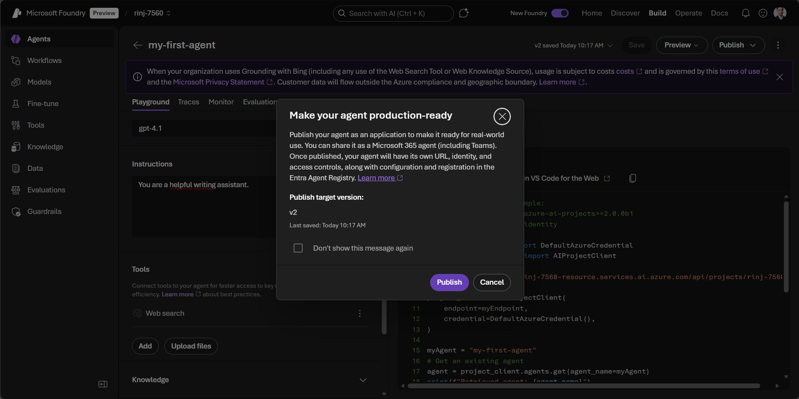

Just like that, your agent is published.

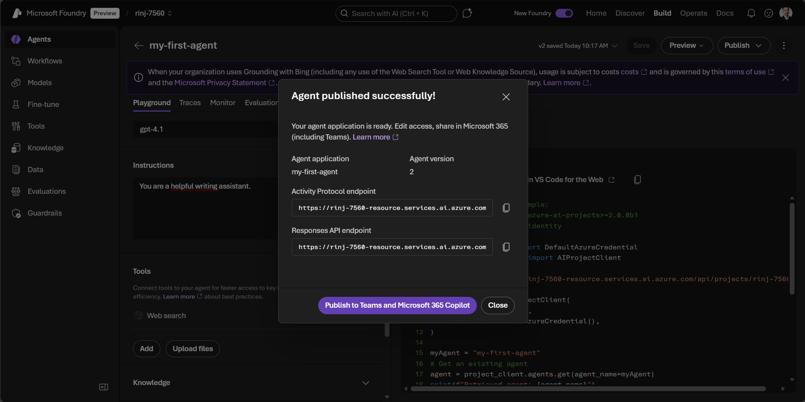

To make it available in Teams or Microsoft 365 Copilot, you must then prepare it for distribution.

Fill in the required details and click **Prepare agent**.

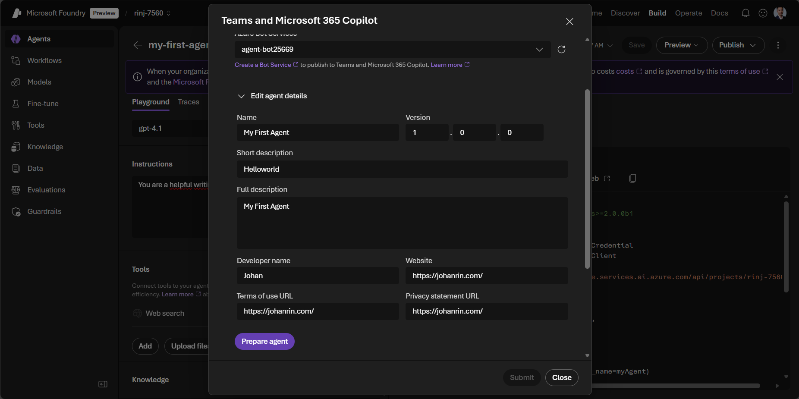

Next, choose the publishing scope and click **Submit**.

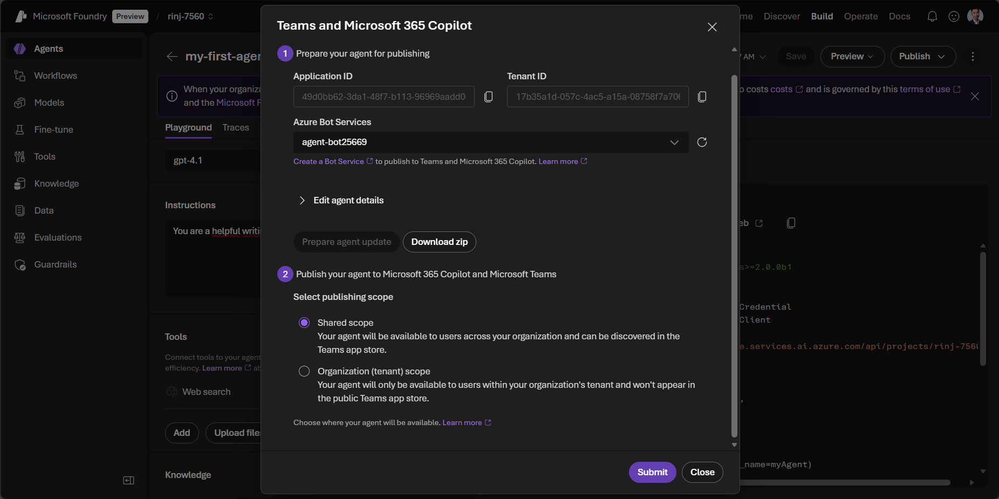

And just like that, your agent is now available in Microsoft 365 Copilot!

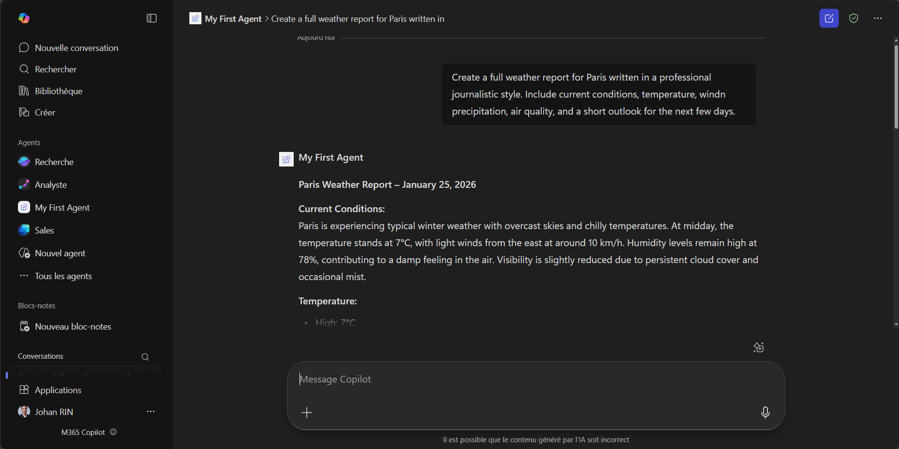

## Conclusion

You built your first agent in Microsoft Foundry and deployed it to Microsoft 365 Copilot! 🎉

In this post, you saw how simple it is to create an agent and configure its key components.

The agent you deployed behaves like a chatbot for now, but this is only the beginning.

More powerful and advanced agents are coming soon.

That’s it for me, hope you learned something.

If you have any questions, feel free to reach out on my social networks!
