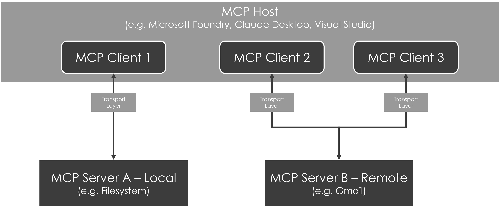
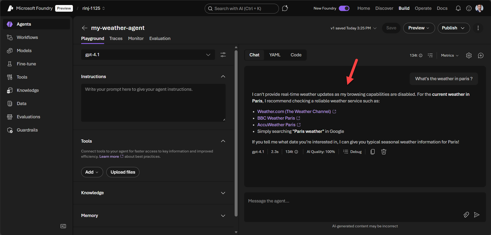
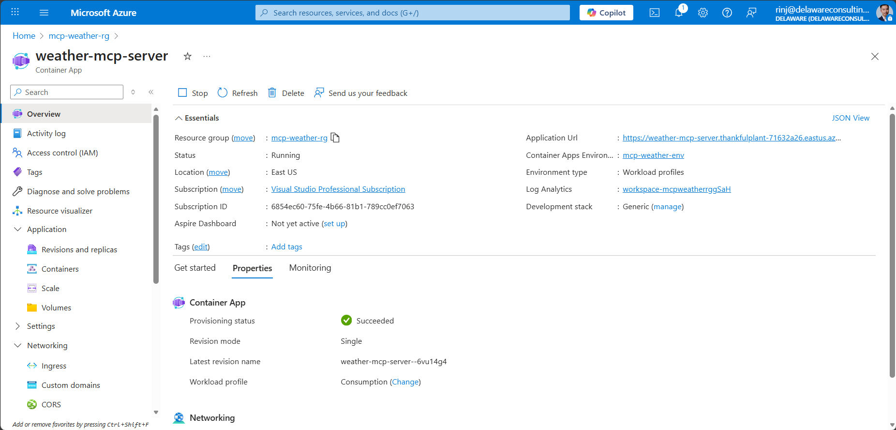
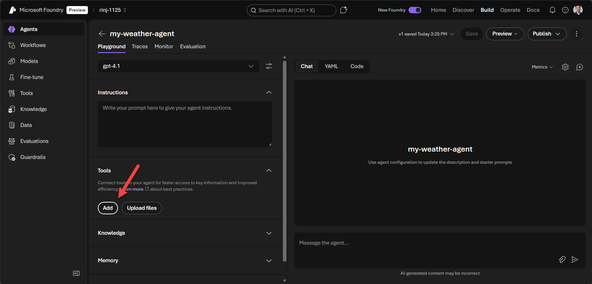
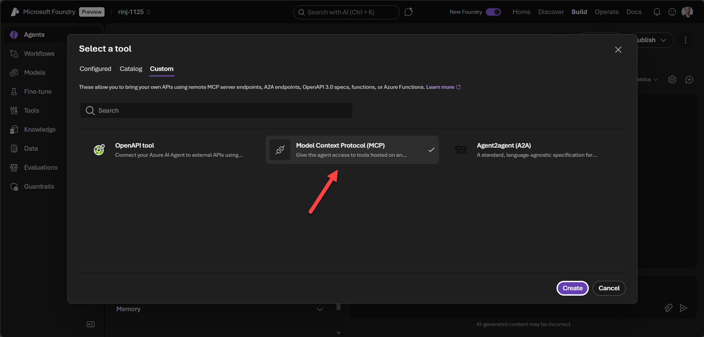
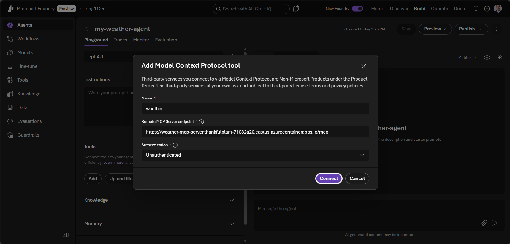
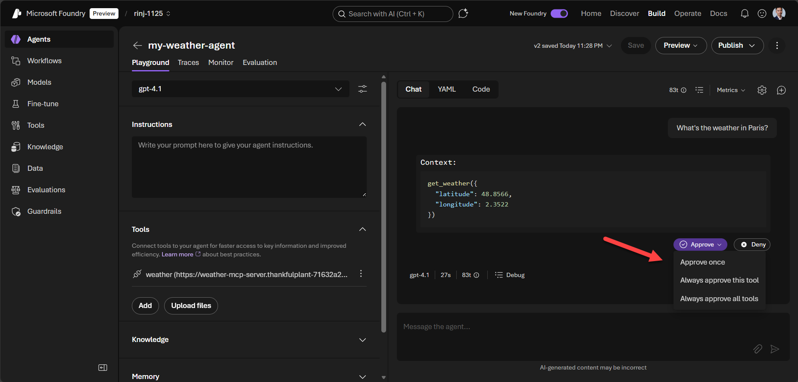
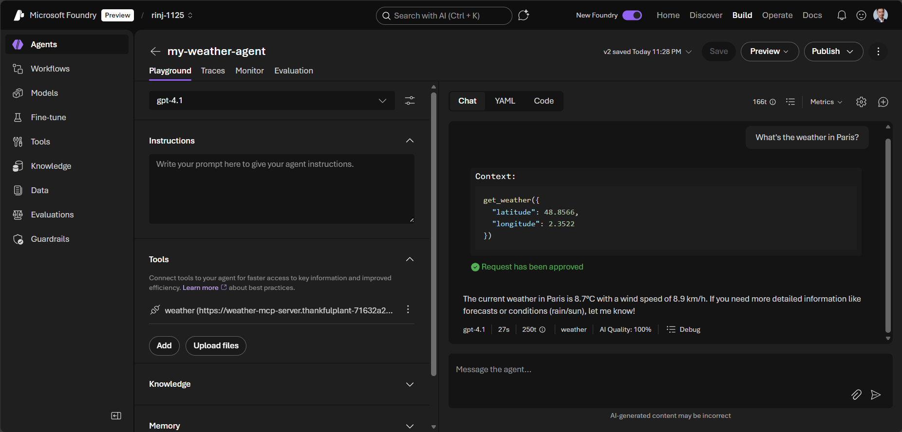

Have you ever asked your Copilot, ChatGPT, or Gemini for information it simply couldn't access?

This is a common limitation of LLMs. They only know what they were trained on.

Yesterday's news? Tomorrow's weather? They can't help you there.

But what if we could supercharge our LLMs with these powers? That's exactly what MCP (Model Context Protocol) enables.

Curious to learn how? Let's go!

**In this tutorial, you'll learn how to:**

- Understand what MCP is and how it works
- Build an MCP server with Python
- Deploy it to Azure Container Apps
- Connect it to Microsoft Foundry

## Meet MCP

To unlock these superpowers, LLMs use MCP.

MCP stands for **[Model Context Protocol](https://modelcontextprotocol.io)**, an open-source standard developed by Anthropic to connect LLMs to external systems and extend their capabilities.

**Think of MCP as a universal API for LLMs.**

It follows a client-server architecture. Clients are AI applications like Microsoft Foundry, Claude Desktop, or Visual Studio Code. They connect to MCP servers that provide additional context and capabilities.

For example, MCP servers can connect to your Gmail, query your database, or fetch live weather data. This gives your LLM access to real, up-to-date information.

For developers, MCP offers a standardized way to extend LLM capabilities: build once, work with any compatible client.

## How MCP works



MCP is composed of two layers: a data layer and a transport layer.

The data layer defines **primitives**, which describe what clients and servers can offer each other:

- **Tools**: functions that clients can execute to perform actions like API calls or file operations
- **Resources**: data exposed to clients, such as file contents or database records
- **Prompts**: reusable templates that structure interactions with the LLM, like system prompts

The transport layer manages communication and authentication between clients and servers. MCP supports two transport mechanisms:

- **Stdio**: for local communication
- **Streamable HTTP**: for remote server communication

All messages use [JSON-RPC 2.0](https://www.jsonrpc.org/) as the communication protocol.

## Build your first MCP server

First, let's see what happens when we ask a weather question in Microsoft Foundry without MCP.



As expected, the agent using GPT-4.1 cannot access live data and returns a generic response.

Let's correct that!

### Prerequisites

- Python 3.12+
- [uv](https://docs.astral.sh/uv/) (recommended) or pip
- [Azure CLI](https://docs.microsoft.com/en-us/cli/azure/install-azure-cli) installed and logged in
- [Docker](https://docs.docker.com/get-docker/)

### Write the code

We will build a simple MCP server using the Python SDK to provide weather information.

All the code is available in this GitHub repository: [johanrin/my-first-mcp-server](https://github.com/johanrin/my-first-mcp-server)

First, let's create the project:

```shell
# Create a new directory for our project
uv init my-first-mcp-server
cd my-first-mcp-server

# Create virtual environment and activate it
uv venv
.venv\Scripts\activate

# Install dependencies
uv add mcp[cli] httpx
```

Edit **main.py** to initialize your MCP server:

```python
import os

import httpx
from mcp.server.fastmcp import FastMCP

# Constants
OPEN_METEO_API_URL = "https://api.open-meteo.com/v1/forecast"

# Configuration from environment variables
HOST = os.getenv("MCP_HOST", "0.0.0.0")
PORT = int(os.getenv("MCP_PORT", "8000"))

# Initialize MCP server
mcp = FastMCP("weather", host=HOST, port=PORT)
```

Next, add a helper function to fetch weather data from the Open-Meteo API:

```python
async def fetch_weather(latitude: float, longitude: float) -> dict | str:
    """Fetch weather data from Open-Meteo API."""
    try:
        async with httpx.AsyncClient() as client:
            response = await client.get(
                OPEN_METEO_API_URL,
                params={
                    "latitude": latitude,
                    "longitude": longitude,
                    "current": "temperature_2m,windspeed_10m",
                },
            )
            response.raise_for_status()
            return response.json()
    except httpx.HTTPError as e:
        return f"Failed to fetch weather data: {e}"
```

Now, implement the tool that the LLM will call:

```python
@mcp.tool()
async def get_weather(latitude: float, longitude: float) -> str:
    """Get current weather for a location."""
    data = await fetch_weather(latitude, longitude)

    if isinstance(data, str):
        return data

    current = data["current"]
    temperature = current["temperature_2m"]
    wind_speed = current["windspeed_10m"]

    return (
        f"Current Weather ({latitude}, {longitude}):\n"
        f"- Temperature: {temperature}°C\n"
        f"- Wind Speed: {wind_speed} km/h"
    )
```

Finally, run the server. We use **streamable-http** transport since the server needs to be remotely accessible:

```python
if __name__ == "__main__":
    mcp.run(transport="streamable-http")
```

### Deploy on Azure

To make our MCP server publicly accessible, we'll deploy it to Azure Container Apps using the Azure CLI.

Open your terminal and run the following commands.

First, define the variables:

```shell
RESOURCE_GROUP="mcp-weather-rg"
LOCATION="eastus"
CONTAINER_ENV="mcp-weather-env"
CONTAINER_APP="weather-mcp-server"
```

Create the resource group:

```shell
az group create --name "$RESOURCE_GROUP" --location "$LOCATION"
```

Create the Container Apps environment:

```shell
az containerapp env create \
    --name "$CONTAINER_ENV" \
    --resource-group "$RESOURCE_GROUP" \
    --location "$LOCATION"
```

Deploy the container app from source:

```shell
az containerapp up \
    --name "$CONTAINER_APP" \
    --resource-group "$RESOURCE_GROUP" \
    --environment "$CONTAINER_ENV" \
    --source . \
    --ingress external \
    --target-port 8000
```



Your MCP server is successfully deployed and ready to be used by MCP clients!

## Use Your MCP Server in Microsoft Foundry

Now that we've deployed our MCP server, let's connect it to Microsoft Foundry.

To do that, go to the Agents section and click **Add** in the Tools section:



Select **Model Context Protocol (MCP)** in the Custom section and click **Create**:



Complete the **Name**, **MCP endpoint**, and **Authentication** sections, then click **Connect**.



In my case, I completed:

- **Name**: weather
- **Remote MCP Server endpoint**: https://weather-mcp-server.thankfulplant-71632a26.eastus.azurecontainerapps.io/mcp
- **Authentication**: Unauthenticated

> **Note:** Don't forget to add **/mcp** at the end of the endpoint.

> **Warning:** Never use unauthenticated MCP servers in production. This is for demo purposes only.

Now you're all set to test your MCP server!

Save your configuration and ask about the weather in your favorite place.

For security reasons, you'll need to **Approve** whether you want to use the tool.



And there it is: a real-time weather response powered by your MCP server!



## Conclusion

You've successfully built an MCP server, deployed it to Azure Container Apps, and connected it to Microsoft Foundry. Your LLM can now access real-time weather data.

From here, you can extend your MCP server with additional tools, add authentication for production use, or explore other MCP primitives like Resources and Prompts.

That's it for me. Hope you learned something!

If you have any questions, feel free to reach out on my social networks!
