Imagine you just finished your dream app in React and search for a way to host it somewhere on the Internet.

Did you know that you can host it on Azure Storage?

No? Let's see how!

Oh, and your app is static…

## Deploy your app in Azure Storage

But first some prerequisites on your laptop:

- Azure CLI is installed, and you can log in to Azure — [https://docs.microsoft.com/en-us/cli/azure/install-azure-cli](https://docs.microsoft.com/en-us/cli/azure/install-azure-cli)
- Azure Storage Explorer is installed, and you can sign in with your Azure credentials to upload content — [https://azure.microsoft.com/en-us/features/storage-explorer](https://azure.microsoft.com/en-us/features/storage-explorer)

Before anything, you need a storage account! Not any storage account, but a **general-purpose v2 storage account**. That's important as the other type of storage accounts aren't static website ready.

Don't forget to create a resource group if you don't have one:

```shell
az group create --location westeurope --name myDreamApp
```

Now, you can create your storage account. Be sure to specify a unique name for the storage account:

```shell
az storage account create --name johanrin --resource-group myDreamApp --kind StorageV2 --location westeurope --sku Standard_LRS
```

Here, we defined a general-purpose v2 storage account named _johanrin_ with locally redundant storage (LRS) in the previously created resource group.

Next, you need to enable static website hosting in your storage account:

```shell
az storage blob service-properties update --account-name johanrin --static-website --index-document index.html
```

Now, your storage account is ready! You can upload your React app in Azure…

But which files? Those from your build directory! So, be sure to build your app with the command `npm run build` and upload the files included only in the **build directory**.

I suggest using Azure Storage Explorer to conveniently upload your files and avoid troubles with the content types!

To do so, expand your storage account previously created in Azure Storage Explorer until you find your **$web** blob container and upload your files and directories:

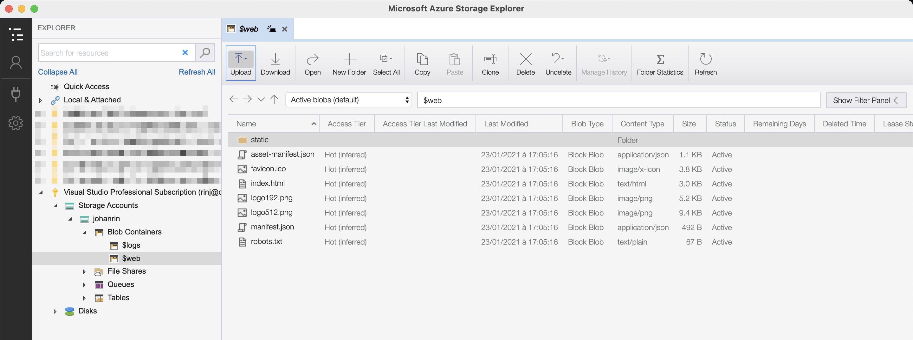

When you're done, go directly to Azure to find your website URL:

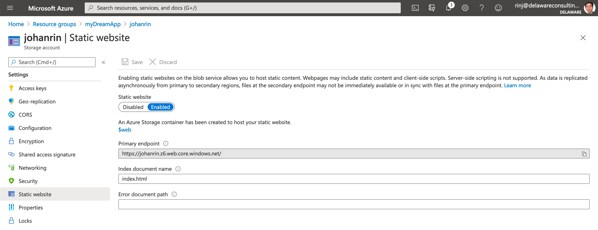

And confirm if your website is working or not:

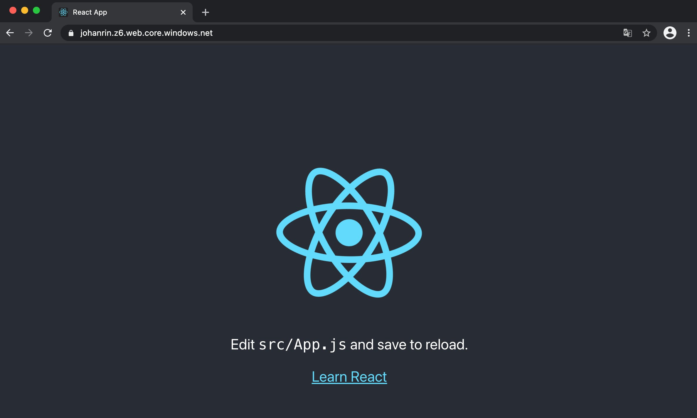

Great, you deployed your app in Azure Storage! But as you can see, the process is manual and not very efficient…

What if we try to automate our current deployment process? Let's go!

## Automate your deployment in Azure Storage

Another prerequisite before continuing:

- All your code is in a GitHub repository!

We're going to use GitHub Actions to deploy automatically your app every time you push your changes.

### Create an Azure service principal

Natively GitHub cannot update your code in your storage account. You need to create a service principal:

```shell
az ad sp create-for-rbac --name johanrin --role Contributor --scopes /subscriptions/6854ec60-75fe-4b66-81b1-789cc0ef7063/resourceGroups/myDreamApp --sdk-auth
```

Here, we created a service principal named _johanrin_ and assigned a Contributor role to the resource group previously created.

The command will create a new entry in your Azure Active Directory:

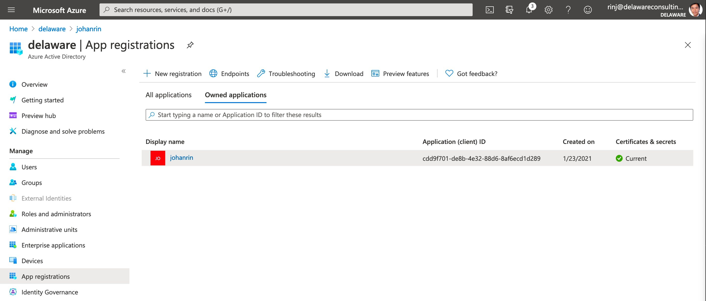

And it will return you something like that:

```json
{
  "clientId": "cdd9f701-de8b-4e32-88d6-8af6ecd1d289",
  "clientSecret": "j&-aKf88~X42Pf4e3m8_kCqqGelnVjfLzP",
  "subscriptionId": "6854ec60-75fe-4b66-81b1-789cc0ef7063",
  "tenantId": "17b35a1d-057c-4ac5-a15a-08758f7a7064",
  "activeDirectoryEndpointUrl": "https://login.microsoftonline.com",
  "resourceManagerEndpointUrl": "https://management.azure.com/",
  "activeDirectoryGraphResourceId": "https://graph.windows.net/",
  "sqlManagementEndpointUrl": "https://management.core.windows.net:8443/",
  "galleryEndpointUrl": "https://gallery.azure.com/",
  "managementEndpointUrl": "https://management.core.windows.net/"
}
```

Be sure to save the output somewhere — but neither in your code nor in GitHub — as you'll need it just after!

### Configure your GitHub repository

The next step is to add your secret to GitHub. To do so, go to **Settings** > **Secrets** > **New repository secret**, complete the fields, and click on **Add secret**:

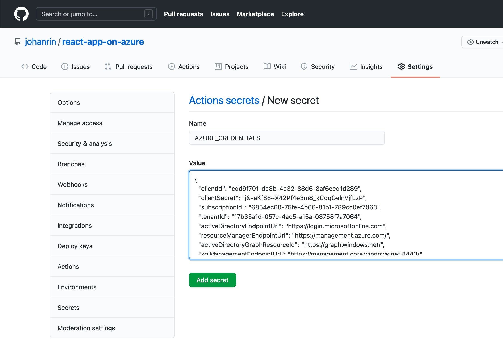

This way, you can now create a new workflow in **Actions** > **New workflow** > **set up a workflow yourself** that will use the credentials to upload your files in Azure:

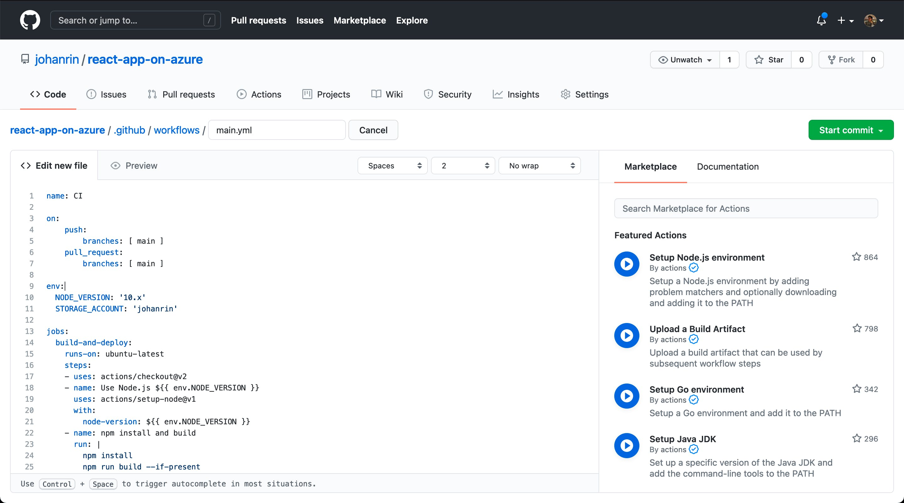

The code used in `main.yml` is below. Don't forget to edit your **STORAGE_ACCOUNT** environment variable:

```yaml
name: CI

on:
  push:
    branches: [main]
  pull_request:
    branches: [main]

env:
  NODE_VERSION: "10.x"
  STORAGE_ACCOUNT: "johanrin"

jobs:
  build-and-deploy:
    runs-on: ubuntu-latest
    steps:
      - uses: actions/checkout@v2
      - name: Use Node.js ${{ env.NODE_VERSION }}
        uses: actions/setup-node@v1
        with:
          node-version: ${{ env.NODE_VERSION }}
      - name: npm install and build
        run: |
          npm install
          npm run build --if-present

      - uses: azure/login@v1
        with:
          creds: ${{ secrets.AZURE_CREDENTIALS }}
      - name: Upload to the storage account
        uses: azure/CLI@v1
        with:
          azcliversion: 2.0.72
          inlineScript: |
            az storage blob upload-batch --source ./build --destination '$web' --account-name ${{ env.STORAGE_ACCOUNT }}
      - name: logout
        run: |
          az logout
```

Here, the code will build your app and upload it to your storage account with the command `az storage blob upload-batch`.

Don't forget to commit your `main.yml` to trigger the workflow! You can confirm if it worked or not on the **Action** page:

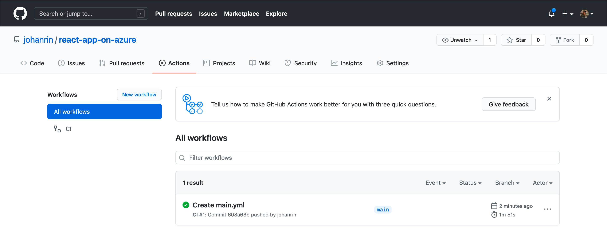

With this workflow in place, every time you push your changes, it will trigger your app's build and deployment! Neat!

But wait, there's more! What if I told you that you don't need to manually set up your workflow?

Yes! Azure can do everything for you: continuous integration and continuous delivery (CI/CD) and directly in Visual Studio Code!

Sounds promising, right? Let's see how directly in the code editor!

## Azure Static Web App

Some prerequisite before starting:

- Azure Static Web Apps extension is installed on Visual Studio Code

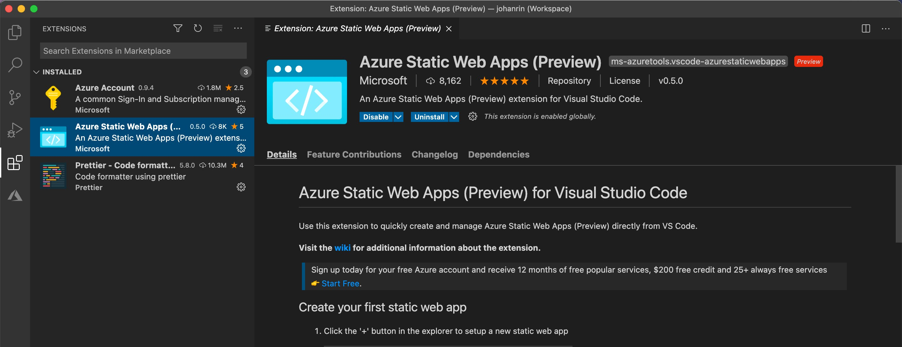

I used a new app in this section but with the same code as before. I did this operation to avoid any conflict with what we did previously. Indeed, we'll create a new GitHub repository with another workflow… So better start from scratch!

Now, in the Azure tab of your Visual Studio Code, click on the **+** to create a new Static Web App and select your subscription:

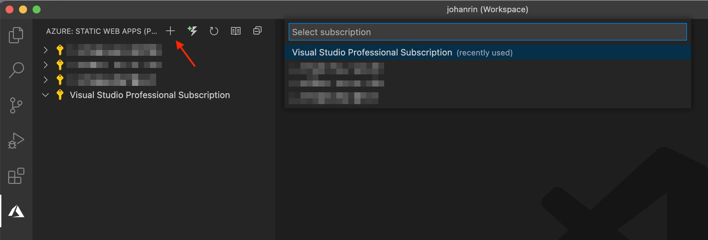

Then, click on **Publish local code to a new GitHub repository**:

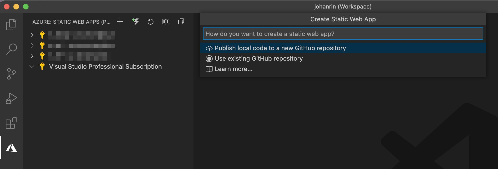

Define the name of your new GitHub repository and press Enter:

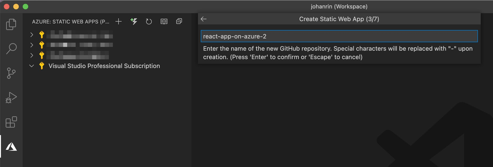

Then, select if you want a public or private GitHub repository:

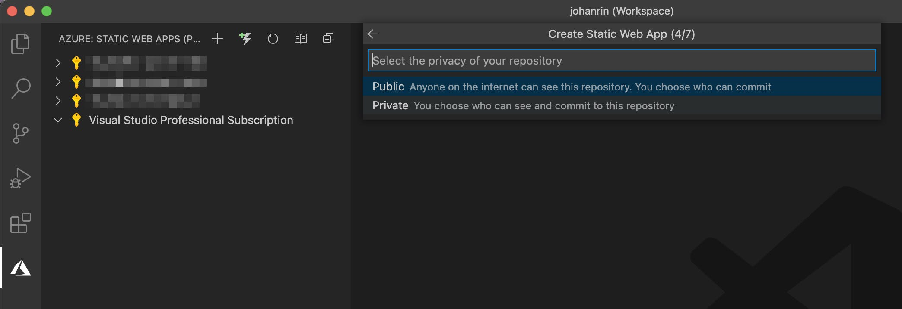

Define now the name of your Static Web App:

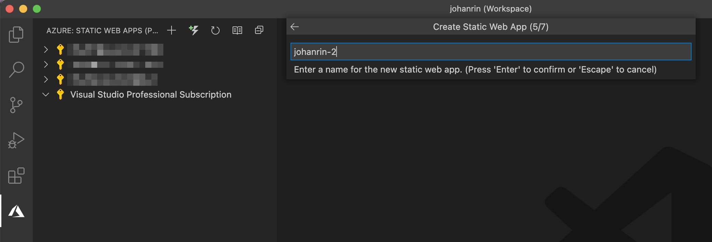

Select **React** as build preset:

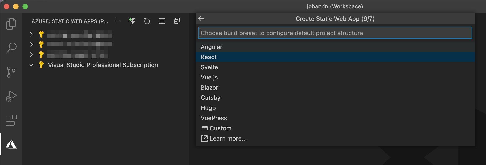

Then select the location of your Static Web App:

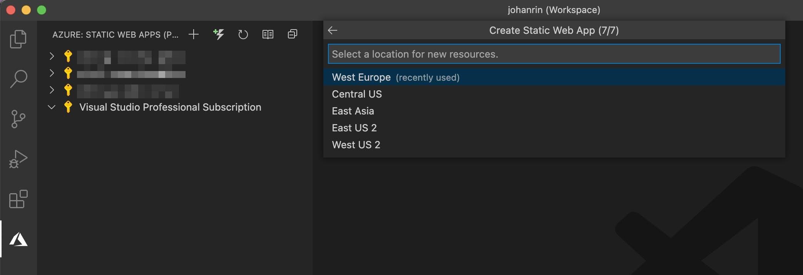

It will trigger the creation of your new GitHub repository and the configuration of your workflow!

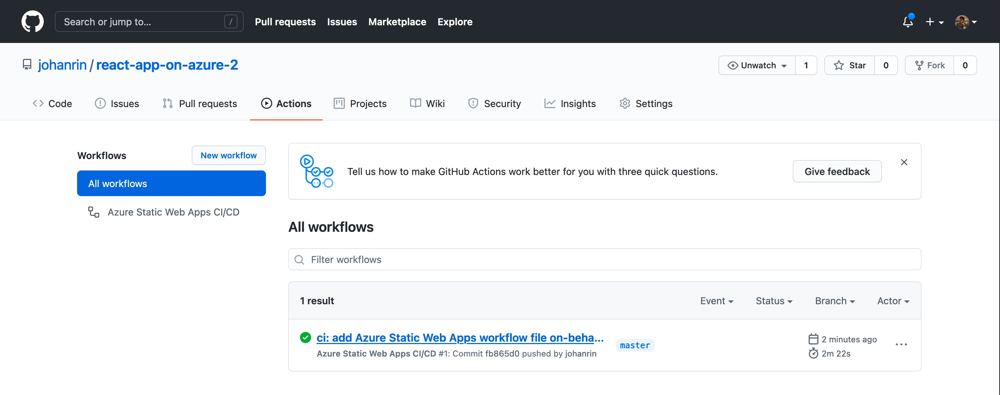

Oh, and your app is already deployed!

To find your website URL, go to Azure:

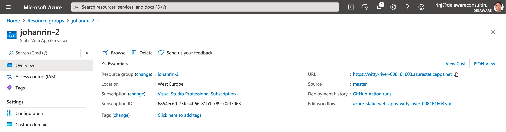

And admire the result!

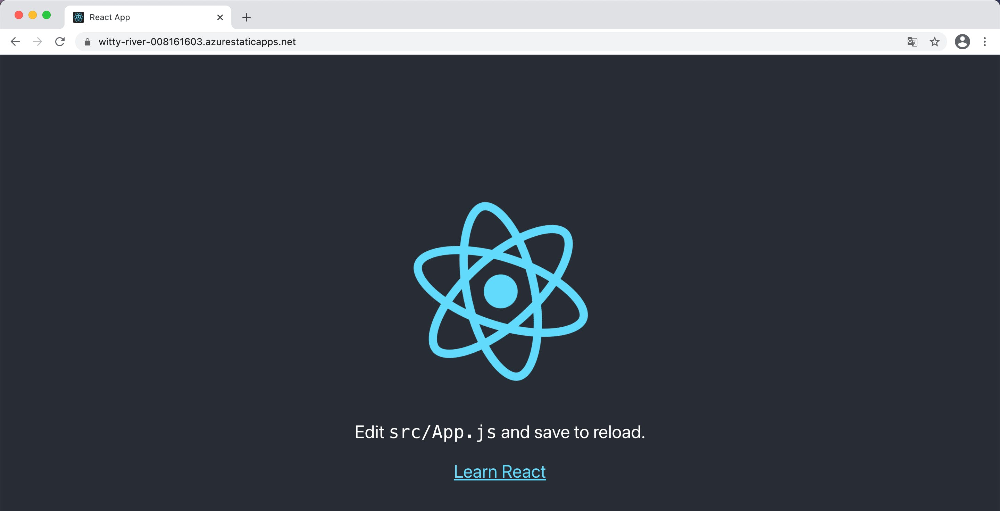

### Conclusion

You deployed your React app to both Azure Storage and Azure Static Web App! 🎉

Even if Azure Static Web Apps is in **preview** at this time (= no SLA), we saw how easy it was to deploy our React app in Azure in just a few clicks compare to Azure Storage.

That's precisely the value proposition of this service: make your deployment easier in Azure that you develop in React or Vue, with CI/CD from day one!

We only focused on the hosting part here, but you can do much more! So, be sure to check the documentation to learn more about Static Web Apps: [https://docs.microsoft.com/en-us/azure/static-web-apps/overview](https://docs.microsoft.com/en-us/azure/static-web-apps/overview)

Oh, and you can find the GitHub repositories I used here:

- [https://github.com/johanrin/react-app-on-azure](https://github.com/johanrin/react-app-on-azure)
- [https://github.com/johanrin/react-app-on-azure-2](https://github.com/johanrin/react-app-on-azure-2)

That's it for me, hope you learned something! If you have any questions, [find me on Twitter](https://twitter.com/johanrin) and feel free to ask me anything 🙏
