At the beginning of this year, I announced that I wanted to focus on Microsoft Foundry.

Today, we're diving into what Microsoft Foundry is and how you can use it to build AI agent, step-by-step.

In this post, I'll give you an overview of the platform, and together we'll deploy a simple agent.

Let's get started.

## Overview

Microsoft Foundry is a Platform as a Service (PaaS) dedicated to AI that runs on Azure.

Microsoft Foundry centralizes model management, agent orchestration, and operational monitoring in one place. This makes it easier to move from experimentation to production, especially for teams already using Azure.

The service was previously known as Azure AI Foundry, but with the recent rebranding, Microsoft aimed to unify all its AI services in a single platform.

To access your Microsoft Foundry resource, you must first deploy it on Azure.

To do this, go to https://ai.azure.com/ and make sure to enable **New Foundry** to create your project.
Behind the scenes, this will provision your Microsoft Foundry resource along with the associated project.

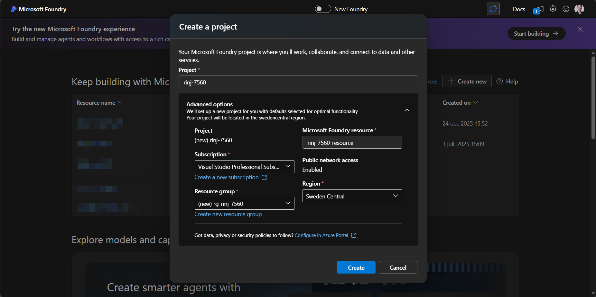

Welcome to your Microsoft Foundry homepage!

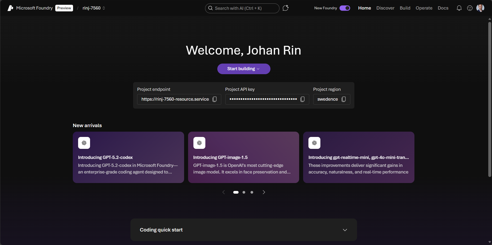

As you can see, it's a minimalist interface composed of three main sections in the navigation bar:

- **Discover**
- **Build**
- **Operate**

These represent the lifecycle of an AI agent on Microsoft Foundry:

- **Discover**, explore available models and tools
- **Build**, create and configure your AI assets
- **Operate**, monitor and manage your workloads

## Discover what's possible

Here, you'll find models and tools highlighted by Microsoft.

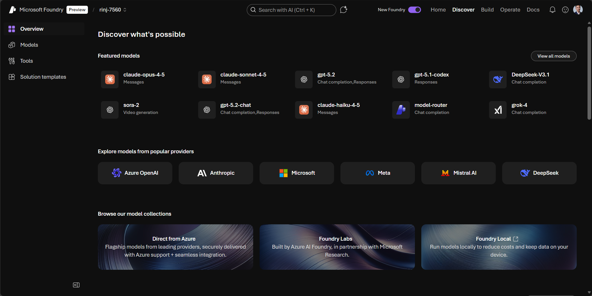

If you click on **Models**, you'll see all the models available on Microsoft Foundry.

At the time of writing, there are 11,300 models available, from various providers such as OpenAI (GPT-5.2) or Anthropic (Claude 4.5).

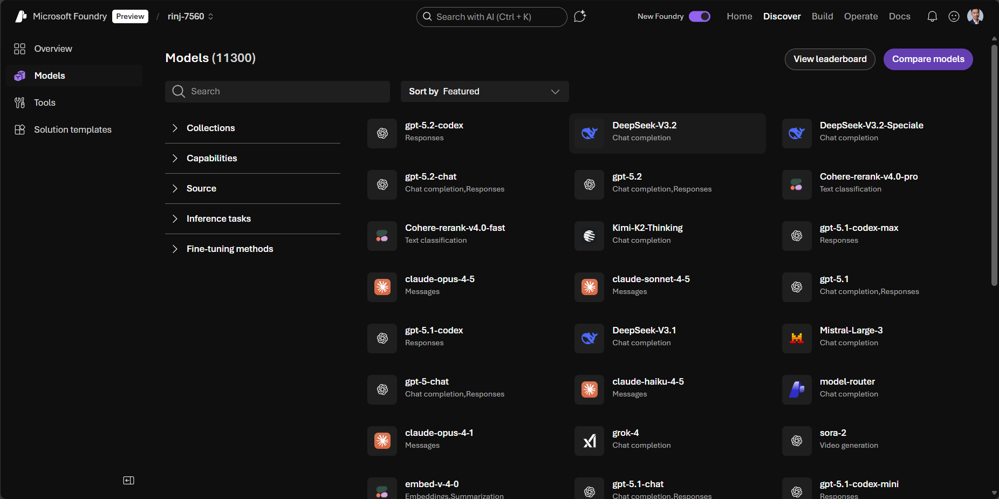

Another cool feature: you can compare different models with just one click using **Compare models**.

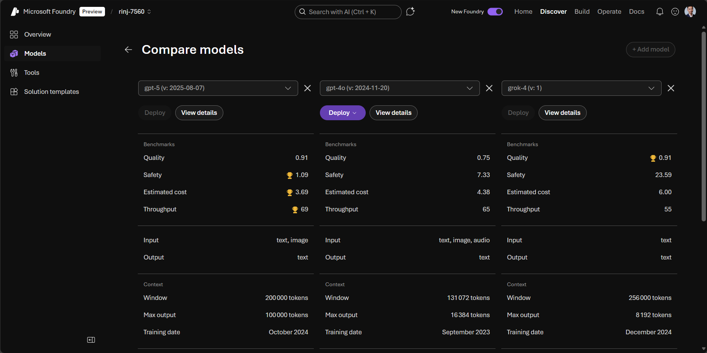

On the **Tools** page, you'll find all the MCP tools available to connect to your AI agents.

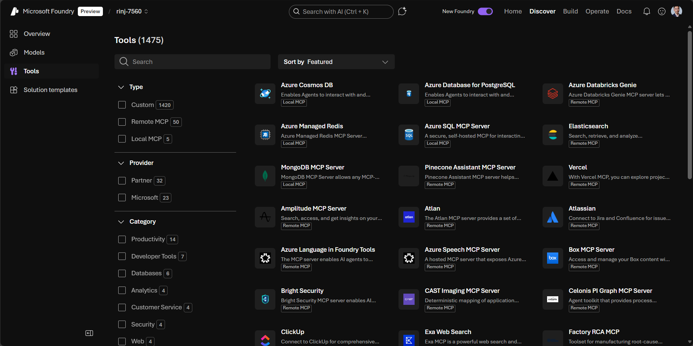

For example, there's an MCP tool for Azure Cosmos DB, which enables your AI agent to retrieve and interact with data from your Cosmos DB accounts.

On the **Solution templates** page, you'll find accelerators designed for common scenarios such as AI chat or multi-agent workflow.

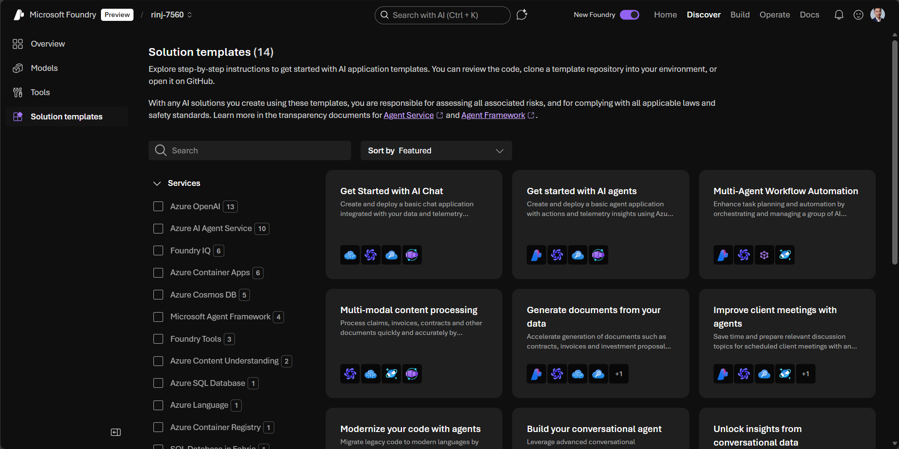

Each template redirects you to a GitHub page with all the necessary instructions to deploy the corresponding resources on Azure.

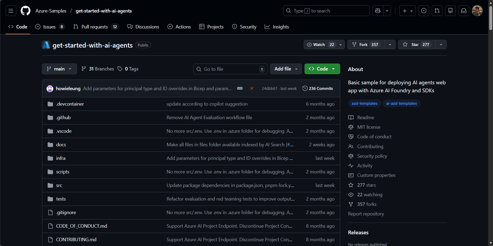

## Build your agent

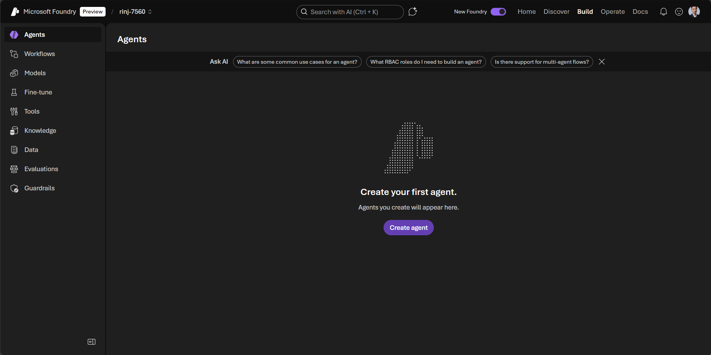

This is the section where you'll spend most of your time. It includes everything you need, from models to guardrails, to build enterprise-ready agents.

I won't go too deep here, as I plan to dedicate future posts to the Build section. That will give you a better sense of how powerful this part of Microsoft Foundry really is.

But to avoid leaving you frustrated, let's deploy a basic agent!

Click **Create agent** and give your agent a name:

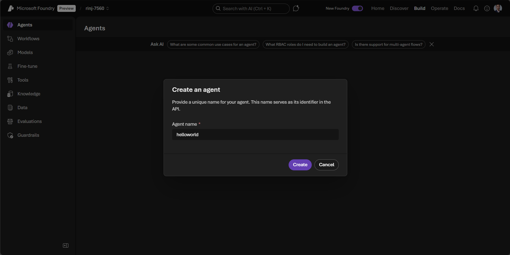

Here, you can configure your AI agent by providing _Instructions_ and adding _Tools_.

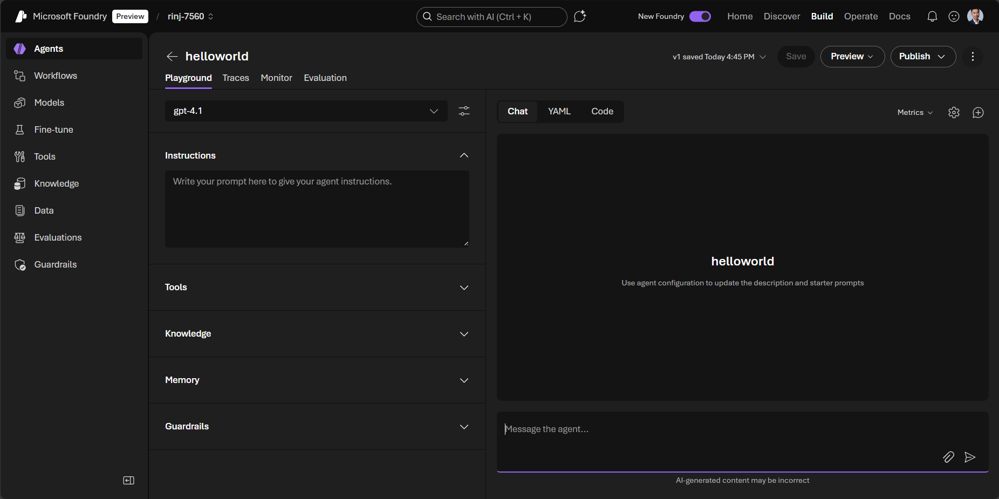

The playground works out of the box, so you can immediately test your agent and interact with it directly in the Chat panel:

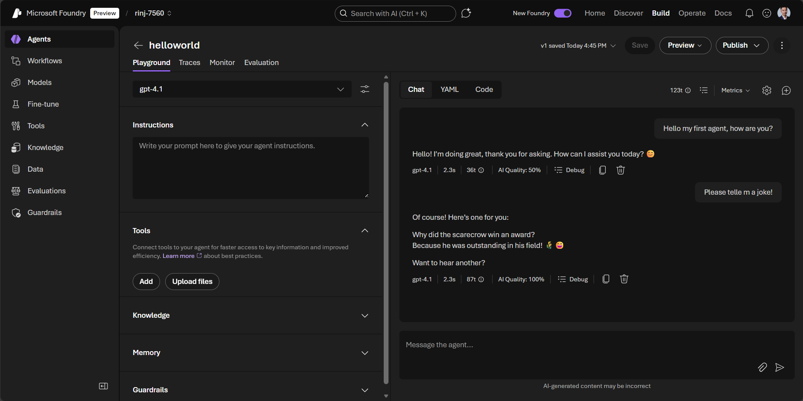

## Operate

Now that we've deployed an agent, let's look at the **Operate** section.

Here, you get an overview of all the agents you've deployed. You can think of it as a control tower, giving you everything you need to monitor and manage your AI agents.

You'll find key metrics such as

- number of running agents
- token usage

This information is crucial for understanding the health and performance of your agents.

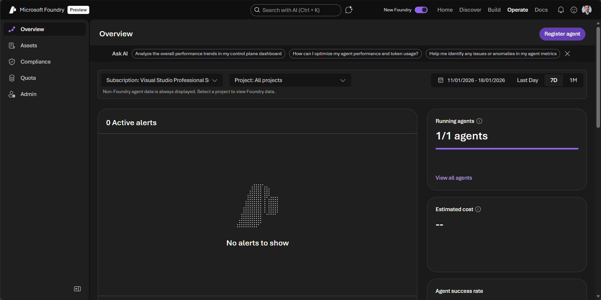

Click **Assets** to get more details about all the assets you've deployed.

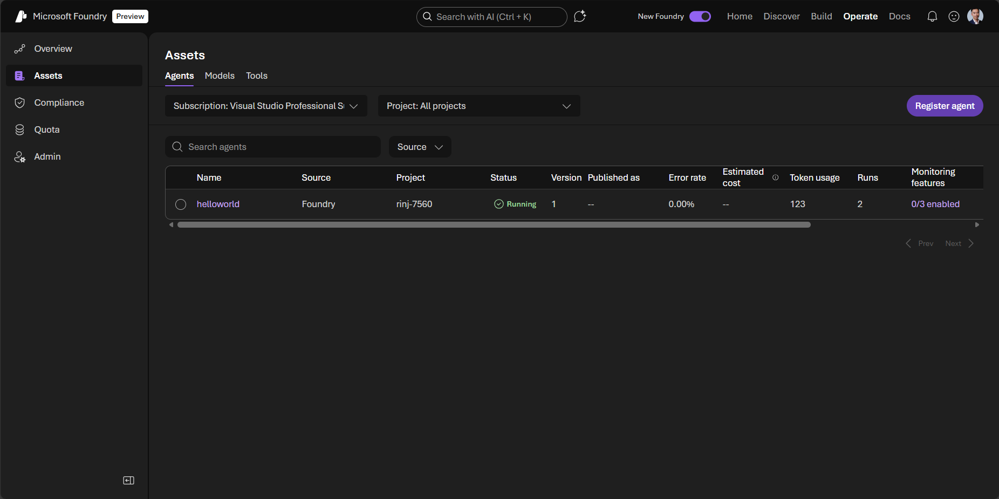

Then check your **Quota** to see your current token consumption and determine whether you need to request a quota increase.

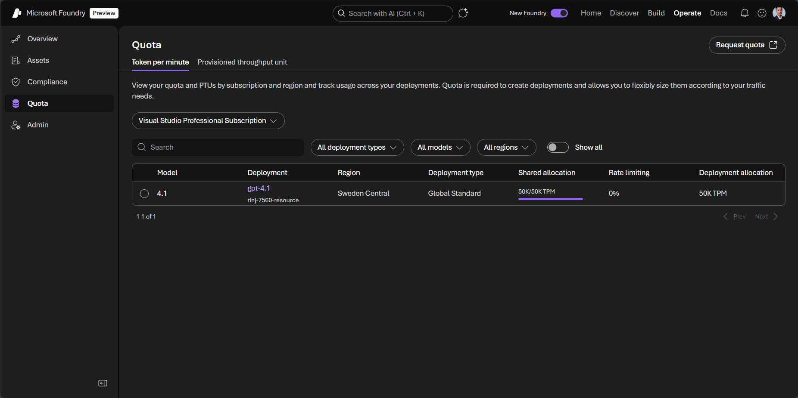

## Conclusion

You now have a solid understanding of what Microsoft Foundry is! 🎉

This was just an overview of the service, and I'm planning to go deeper into the **Build** section in upcoming posts.

That's it for me, hope you learned something!

If you have any questions, feel free to reach out on my social networks!
