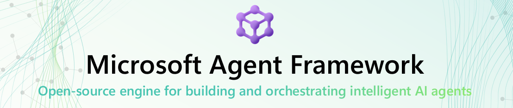

You want to build an AI agent with code. You search "Microsoft agent framework" and find Semantic Kernel. Then AutoGen. Then you realize both are from Microsoft. Two frameworks, same company.

Which one do you pick?

Here's the thing: you don't have to choose anymore. Microsoft merged both projects into a single framework called **Microsoft Agent Framework**.

In my [previous post](https://johanrin.com/posts/how-to-use-model-router-on-microsoft-foundry/), I showed you how to use Model Router on Microsoft Foundry. Today, let's look at this new framework and build our first agent with it.

**In this post, you'll learn how to:**

- Understand where Microsoft Agent Framework comes from
- Create your first agent in Python
- Know what else the framework can do
- See where it fits compared to other frameworks

Let's dive in.

## Where Does It Come From?

Microsoft had two projects running in parallel for a while:

**Semantic Kernel** was the enterprise SDK. Production-ready, well-supported, and popular in the .NET ecosystem.

**AutoGen** came from Microsoft Research. It pioneered multi-agent orchestration patterns like group chat and quickly gained traction in the open-source community.

Both were good. But having two frameworks from the same company was confusing for everyone.

In October 2025, Microsoft decided to merge them. Semantic Kernel's stability meets AutoGen's multi-agent patterns. That's Microsoft Agent Framework.

The framework is open-source and supports both **.NET** and **Python**.



## Your First Agent in Python

Enough context. Let's write some code.

Install the package:

```bash
pip install agent-framework --pre
```

> **Note:** The `--pre` flag is required while the framework is in Release Candidate.

Set up your environment variables:

```bash
export AZURE_AI_PROJECT_ENDPOINT="https://<your-resource>.openai.azure.com/"
export AZURE_OPENAI_RESPONSES_DEPLOYMENT_NAME="gpt-4o-mini"
```

Create your agent:

```python
import os
import asyncio
from dotenv import load_dotenv
from azure.identity import AzureCliCredential
from agent_framework.azure import AzureOpenAIResponsesClient

load_dotenv()

async def main():
    credential = AzureCliCredential()
    client = AzureOpenAIResponsesClient(
        project_endpoint=os.environ["AZURE_AI_PROJECT_ENDPOINT"],
        deployment_name=os.environ["AZURE_OPENAI_RESPONSES_DEPLOYMENT_NAME"],
        credential=credential,
    )

    agent = client.as_agent(
        name="HelloAgent",
        instructions="You are a friendly assistant. Keep your answers brief.",
    )

    result = await agent.run("What is the capital of France?")
    print(result)

if __name__ == "__main__":
    asyncio.run(main())
```

That's it. A few lines and you have a working agent.

You can also stream the response token by token:

```python
async for chunk in agent.run("Tell me a fun fact.", stream=True):
    if chunk.text:
        print(chunk.text, end="", flush=True)
```

From here, you can add tools, multi-turn sessions, and more. But this is all you need to get started.

> **Tip:** Check out the [full sample on GitHub](https://github.com/microsoft/agent-framework/blob/main/python/samples/01-get-started/01_hello_agent.py) for the complete runnable file. The repo contains progressive samples covering [tools, sessions, context providers, and workflows](https://github.com/microsoft/agent-framework/tree/main/python/samples/01-get-started). You'll also find more advanced examples for [agent providers](https://github.com/microsoft/agent-framework/tree/main/python/samples/02-agents) and [workflow orchestration](https://github.com/microsoft/agent-framework/tree/main/python/samples/03-workflows). Microsoft also maintains a dedicated [Agent-Framework-Samples](https://github.com/microsoft/Agent-Framework-Samples) repo with hands-on tutorials from beginner to multi-agent systems.

## Multi-Agent Workflows

Single agents are great, but real-world applications often need multiple agents working together.

MAF ships with a workflow engine that supports different orchestration patterns:

- **Sequential**: one agent after another
- **Concurrent**: multiple agents at the same time
- **Handoff**: one agent passes control to another
- **Group Chat**: agents discuss together
- **Magentic**: a manager agent plans, delegates, and coordinates specialized agents for complex tasks

All of them support streaming out of the box.

I'll cover orchestration patterns in a dedicated post. There's a lot to unpack.

## Connecting Tools

MAF supports three ways to connect your agents to external tools and services:

- **MCP** for dynamic tool connections
- **A2A** for agent-to-agent communication across runtimes
- **OpenAPI** for any REST API

If you've read my post on [deploying an MCP server on Microsoft Foundry](https://johanrin.com/posts/deploy-mcp-server-microsoft-foundry/), MAF is how you connect those tools to your agents with code.

## How Does It Compare?

MAF is not the only agent framework out there. **LangGraph** and **CrewAI** both have strong communities and real production deployments.

Where MAF stands out is if you're already working with Azure, .NET, or Microsoft 365. The integration is native, you get production SLAs, and compliance is built in.

If you're outside the Microsoft ecosystem, LangGraph or CrewAI might be a better starting point.

## Current Status

As of February 2026, the framework has reached **Release Candidate** for both .NET and Python. The API is stable, all v1.0 features are in, and GA should follow in the coming weeks.

Worth checking out:

- [GitHub repo](https://github.com/microsoft/agent-framework)
- [RC announcement](https://devblogs.microsoft.com/foundry/microsoft-agent-framework-reaches-release-candidate/)
- [Quick-start guide](https://learn.microsoft.com/en-us/agent-framework/get-started/your-first-agent)

## Conclusion

The agent framework landscape has been messy. Too many options, too much overlap. Microsoft Agent Framework cleans that up on the Microsoft side by bringing Semantic Kernel and AutoGen together.

If you're building agents on Azure, this is the framework to learn. Give it a try and let me know what you think!

That's it for today. Hope you learned something!

If you have any questions, feel free to reach out on my socials!
