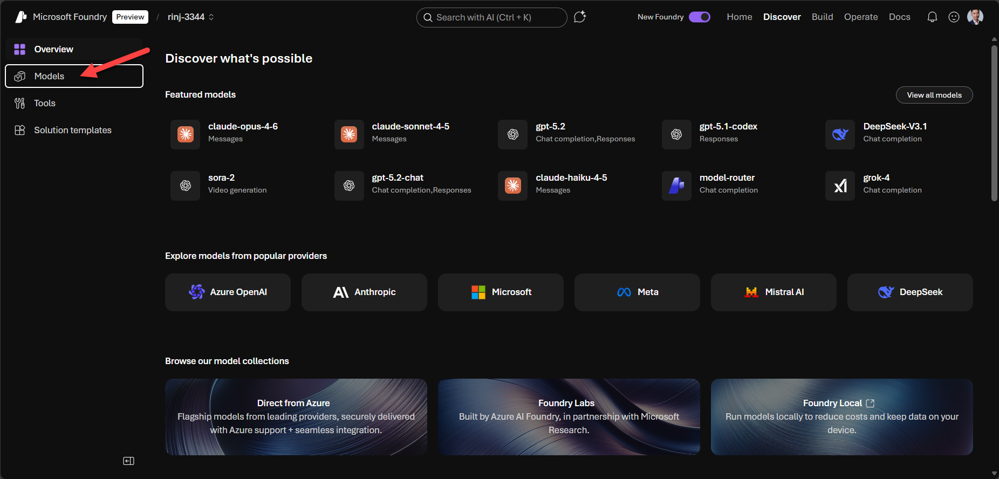
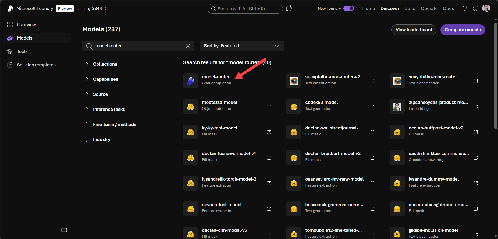
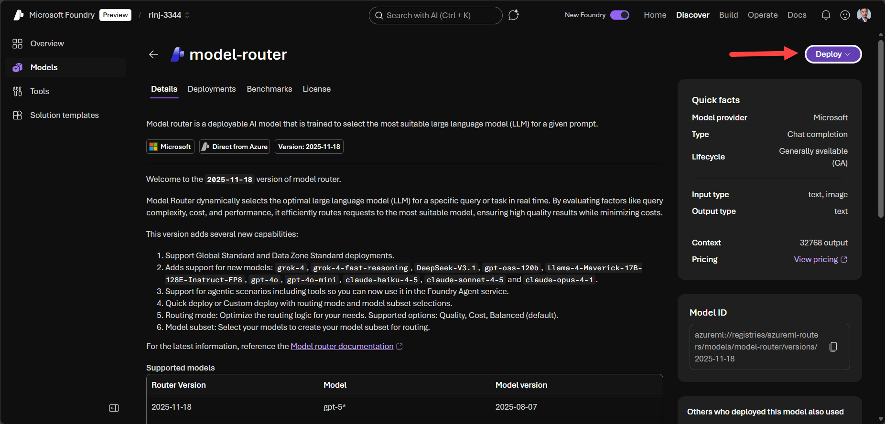
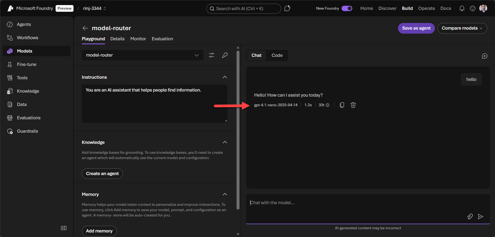
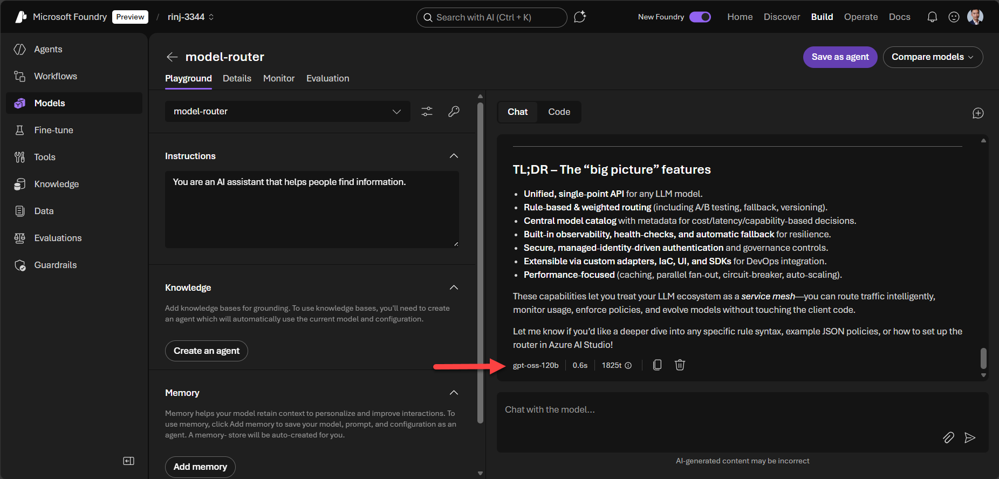
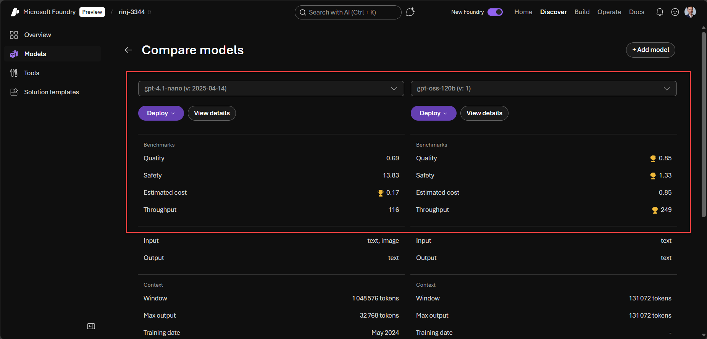

Imagine you're building an app that calls an LLM. You default to Claude Opus 4.6 for everything. It works great. Until you see the bill.

Here's the thing: not every prompt needs the most powerful model. A simple "summarize this email" doesn't require the same firepower as "analyze this entire codebase and suggest improvements."

What if the system could make that call for you, in real time?

In my [previous post](https://johanrin.com/posts/deploy-mcp-server-microsoft-foundry/), I showed you how to deploy an MCP server on Microsoft Foundry. Today, let's explore another powerful feature: **Model Router**, Microsoft Foundry's built-in approach to intelligent LLM routing.

**In this post, you'll learn how to:**

- Understand what LLM routing is and why it matters
- Deploy Azure Model Router on Microsoft Foundry
- Test it with different prompt complexities
- Know when to use it (and when not to)

Let's dive in.

## What is LLM Routing?

LLM routing is a layer that picks the right model for each prompt, automatically. Think smart dispatcher, matching each request to the right model.

The core idea is simple: match each prompt to the best model for the job, at the lowest price.

There are different ways to implement this, but in this post I'll focus on **fully managed routing**, the approach used by Microsoft Foundry Model Router and Amazon Bedrock Intelligent Prompt Routing.

## Meet Azure Model Router

Azure Model Router is Microsoft's managed solution for LLM routing. You deploy a single endpoint that dynamically routes each prompt in real time to the most suitable LLM. It's deployed on [Microsoft Foundry](https://johanrin.com/posts/getting-started-with-microsoft-foundry/) just like any other model.

At the time of writing, the latest version of the Model Router encapsulates the following models:

| Provider  | Models                                                                                                       |
| --------- | ------------------------------------------------------------------------------------------------------------ |
| OpenAI    | gpt-5, gpt-5-mini, gpt-5-nano, gpt-5-chat, gpt-4.1, gpt-4.1-mini, gpt-4.1-nano, gpt-4o, gpt-4o-mini, o4-mini |
| Microsoft | gpt-oss-120b                                                                                                 |
| DeepSeek  | DeepSeek-V3.1                                                                                                |
| Meta      | Llama-4-Maverick-17B-128E-Instruct-FP8                                                                       |
| xAI       | grok-4, grok-4-fast-reasoning                                                                                |
| Anthropic | claude-opus-4-1, claude-sonnet-4-5, claude-haiku-4-5                                                         |

> **Note:** Anthropic models require a separate deployment before they can be used with Model Router.

## Hands-On Tutorial

Now that we know what Azure Model Router is, let's deploy it on [Microsoft Foundry](https://ai.azure.com/nextgen).

Click on **Discover** in the navigation bar and select the **Models** section.

Search for "model router" and select it.

Here you'll find all the details about the Model Router. Click **Deploy** to deploy it with the default settings.

Now let's test the Model Router in the playground.

We'll start with a simple prompt: just saying hello.

The Model Router recognizes a straightforward prompt and routes it to gpt-4.1-nano. As expected, nothing complicated.

Now let's try something more challenging: asking it to summarize its own documentation.

This time, the router selected gpt-oss-120b instead. Since the request was more complex, the Model Router chose a more capable model.

Comparing both models, the second one is more capable but also more expensive. That's the trade-off the router is making for you, automatically.

## When to Use It (and When Not To)

Model Router shines when you're handling high-volume workloads with diverse prompt complexity.

However, if you're building a single-purpose app or need deterministic model selection, it's not the right fit. You're better off picking a specific model and sticking with it.

Also worth noting: you're **limited to the models encapsulated by Model Router**. If your use case requires a specific model, deploy that model directly.

One use case I find particularly interesting: testing. If you're unsure how complex your prompts actually are, the Model Router can help you measure that. Let it route for a while, observe which models it selects, and use that data to inform your final model choice.

## Conclusion

In the middle of the "best model" race, it's easy to forget that not every prompt needs the latest and greatest. LLM routing exists to solve exactly that, matching each request to the right model and saving you money in the process.

Azure Model Router is Microsoft's take on this, and it's surprisingly easy to get started with. Give it a try and let me know if it was cost-effective for your use case!

That's it for today. Hope you learned something!

If you have any questions, feel free to reach out on my socials!
